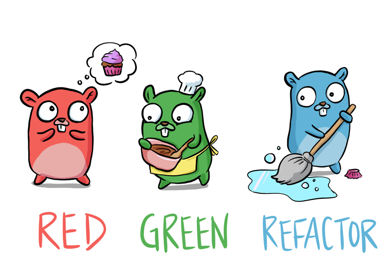

# Изучаем Go с помощью тестов

[Иллюстрация Денизы](https://deniseyu.io/)

## Поддержите меня

Я с гордостью предлагаю этот ресурс бесплатно, но если вы хотите выразить свою признательность:

* [Напишите мне в Твиттере @quii](https://twitter.com/quii)
* [Mastodon](https://mastodon.cloud/@quii)
* [Купите мне кофе](https://www.buymeacoffee.com/quii)
* [Спонсируйте меня на GitHub](https://github.com/sponsors/quii)

## Изучаем разработку через тестирование (TDD) с Go

* Изучайте язык Go, **пиша тесты**
* **Получите основы TDD**. Go — хороший язык для изучения TDD, потому что он прост в освоении, а тестирование встроено в него.
* Будьте уверены, что сможете начать писать надёжные, хорошо протестированные системы на Go.

Переводы:

* [中文](https://studygolang.gitbook.io/learn-go-with-tests)
* [Português](https://larien.gitbook.io/aprenda-go-com-testes/)
* [日本語](https://andmorefine.gitbook.io/learn-go-with-tests/)
* [Français](https://goosegeesejeez.gitbook.io/apprendre-go-par-les-tests)
* [한국어](https://miryang.gitbook.io/learn-go-with-tests/)
* [Türkçe](https://halilkocaoz.gitbook.io/go-programlama-dilini-ogren/)
* [Nederlands](https://bobkosse.gitbook.io/leer-go-met-tests)

## Предыстория

У меня есть опыт внедрения Go в команды разработки, и я пробовал различные подходы к тому, как вырастить команду из нескольких человек, интересующихся Go, в высокоэффективных разработчиков систем на Go.

### Что не сработало

#### Прочитать _ту самую_ книгу

Один из подходов, который мы пробовали, заключался в том, чтобы взять [«синюю книгу»](https://www.amazon.co.uk/Programming-Language-Addison-Wesley-Professional-Computing/dp/0134190440) и каждую неделю обсуждать следующую главу вместе с упражнениями.

Я люблю эту книгу, но она требует высокого уровня приверженности. Книга очень подробно объясняет концепции, что, конечно, отлично, но это означает, что прогресс медленный и постепенный — это подходит не всем.

Я обнаружил, что, хотя небольшое число людей читало главу X и выполняло упражнения, многие этого не делали.

#### Решить несколько задач

Каты — это весело, но их возможности для изучения языка обычно ограничены; вы вряд ли будете использовать goroutines для решения каты.

Ещё одна проблема возникает, когда у людей разный уровень энтузиазма. Некоторые люди изучают язык гораздо глубже, чем другие, и, демонстрируя свои достижения, в итоге сбивают с толку остальных функциями, с которыми они не знакомы.

В конечном итоге это делает обучение довольно _неструктурированным_ и _бессистемным_.

### Что сработало

Безусловно, самым эффективным способом было постепенное знакомство с основами языка путём прочтения [go by example](https://gobyexample.com/), изучения их на примерах и обсуждения в группе. Это был более интерактивный подход, чем «прочитать главу X в качестве домашнего задания».

Со временем команда получила прочную основу _грамматики_ языка, так что мы смогли начать создавать системы.

Мне это кажется аналогичным практике гамм при обучении игре на гитаре.

Неважно, насколько артистичным вы себя считаете, вы вряд ли напишете хорошую музыку без понимания основ и отработки механики.

### Что работает для меня

Когда _я_ изучаю новый язык программирования, я обычно начинаю с экспериментов в REPL, но в конечном итоге мне нужна более структурированная подача.

Мне нравится исследовать концепции, а затем закреплять идеи с помощью тестов. Тесты проверяют правильность написанного мной кода и документируют изученную мной функцию.

Опираясь на свой опыт обучения в группе и на свой личный подход, я собираюсь попытаться создать нечто, что, надеюсь, окажется полезным для других команд. Изучение основ путём написания небольших тестов, чтобы затем вы могли применить свои существующие навыки проектирования программного обеспечения и выпускать отличные системы.

## Для кого это

* Для тех, кто заинтересован в изучении Go
* Для тех, кто уже немного знаком с Go, но хочет глубже изучить тестирование

## Что вам понадобится

* Компьютер!
* [Установленный Go](https://golang.org/)
* Текстовый редактор
* Некоторый опыт программирования. Понимание концепций, таких как `if`, переменных, функций и т. д.
* Умение работать в терминале

## Обратная связь

* Добавляйте issues/отправляйте PR [здесь](https://github.com/quii/learn-go-with-tests) или [напишите мне в Твиттере @quii](https://twitter.com/quii)

[Лицензия MIT](LICENSE.md)