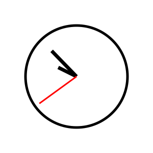
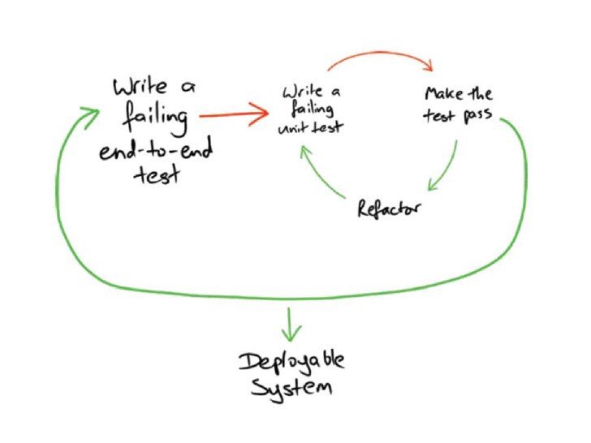
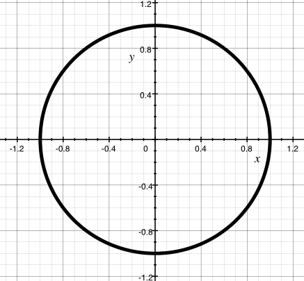
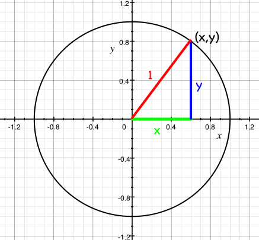
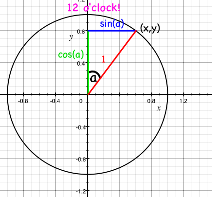
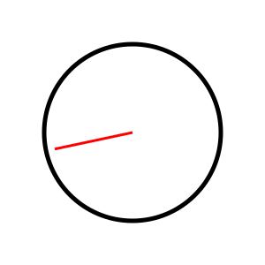

# Математика

[**Весь код для этой главы вы найдете здесь**](https://github.com/quii/learn-go-with-tests/tree/main/math)

Несмотря на всю мощь современных компьютеров, способных выполнять огромные вычисления с молниеносной скоростью, средний разработчик редко использует математику в своей работе. Но не сегодня! Сегодня мы будем использовать математику для решения _настоящей_ проблемы. И не скучную математику — мы будем использовать тригонометрию, векторы и все прочее, о чем вы всегда говорили, что вам никогда не придется использовать это после школы.

## Проблема

Вы хотите создать SVG-изображение часов. Не цифровых часов – нет, это было бы слишком просто – а _аналоговых_, со стрелками. Вам не нужно ничего вычурного, просто хорошая функция, которая принимает `Time` из пакета `time` и выдает SVG-изоизображение часов со всеми стрелками – часовой, минутной и секундной – указывающими в правильном направлении. Насколько это может быть сложно?

Сначала нам понадобится SVG-изображение часов, чтобы мы могли с ним работать. SVG – это фантастический формат изображений для программного манипулирования, потому что они записываются как серия фигур, описанных в XML. Итак, эти часы:



описываются так:

```xml
<?xml version="1.0" encoding="UTF-8" standalone="no"?>
<!DOCTYPE svg PUBLIC "-//W3C//DTD SVG 1.1//EN" "http://www.w3.org/Graphics/SVG/1.1/DTD/svg11.dtd">
<svg xmlns="http://www.w3.org/2000/svg"
     width="100%"
     height="100%"
     viewBox="0 0 300 300"
     version="2.0">

  <!-- bezel -->
  <circle cx="150" cy="150" r="100" style="fill:#fff;stroke:#000;stroke-width:5px;"/>

  <!-- hour hand -->
  <line x1="150" y1="150" x2="114.150000" y2="132.260000"
        style="fill:none;stroke:#000;stroke-width:7px;"/>

  <!-- minute hand -->
  <line x1="150" y1="150" x2="101.290000" y2="99.730000"
        style="fill:none;stroke:#000;stroke-width:7px;"/>

  <!-- second hand -->
  <line x1="150" y1="150" x2="77.190000" y2="202.900000"
        style="fill:none;stroke:#f00;stroke-width:3px;"/>
</svg>
```

Это круг с тремя линиями, каждая из которых начинается в центре круга (x=150, y=150) и заканчивается на некотором расстоянии.

Итак, мы собираемся как-то реконструировать вышеизложенное, но изменить линии так, чтобы они указывали в соответствующих направлениях для заданного времени.

## Приемочный тест

Прежде чем мы углубимся в это, давайте подумаем о приемочном тесте.

Подождите, вы еще не знаете, что такое приемочный тест. Позвольте мне попытаться объяснить.

Позвольте мне спросить вас: как выглядит победа? Как мы узнаем, что закончили работу? TDD предлагает хороший способ узнать, когда вы закончили: когда тест проходит. Иногда бывает приятно – на самом деле, почти всегда приятно – написать тест, который сообщает вам, когда вы закончили писать всю пригодную для использования функцию. Не просто тест, который сообщает, что конкретная функция работает так, как вы ожидаете, а тест, который сообщает, что все, чего вы пытаетесь достичь – «фича» – завершено.

Эти тесты иногда называют «приемочными тестами» (acceptance tests), иногда «фиче-тестами» (feature tests). Идея состоит в том, что вы пишете очень высокоуровневый тест, чтобы описать то, чего вы пытаетесь достичь – например, пользователь нажимает кнопку на веб-сайте, и он видит полный список пойманных им покемонов. Когда мы написали этот тест, мы можем написать больше тестов – модульных тестов – которые приведут к рабочей системе, которая пройдет приемочный тест. Так, для нашего примера эти тесты могут быть о рендеринге веб-страницы с кнопкой, тестировании обработчиков маршрутов на веб-сервере, выполнении запросов к базе данных и т. д. Все это будет реализовано с использованием TDD, и все это будет способствовать прохождению исходного приемочного теста.

Что-то вроде этой _классической_ картины Ната Прайса и Стива Фримена:



В любом случае, давайте попробуем написать этот приемочный тест – тот, который даст нам знать, когда мы закончим.

У нас есть пример часов, поэтому давайте подумаем о том, каковы будут важные параметры.

```
<line x1="150" y1="150" x2="114.150000" y2="132.260000"
        style="fill:none;stroke:#000;stroke-width:7px;"/>
```

Центр часов (атрибуты `x1` и `y1` для этой линии) одинаков для каждой стрелки часов. Числа, которые необходимо изменить для каждой стрелки часов – параметры для всего, что строит SVG – это атрибуты `x2` и `y2`. Нам понадобятся X и Y для каждой стрелки часов.

Я _мог бы_ подумать о большем количестве параметров – радиусе циферблата, размере SVG, цветах стрелок, их форме и т. д... но лучше начать с решения простой, конкретной проблемы простым, конкретным решением, а затем начать добавлять параметры, чтобы сделать его более общим.

Итак, мы скажем, что

*   каждые часы имеют центр (150, 150)
*   часовая стрелка длиной 50
*   минутная стрелка длиной 80
*   секундная стрелка длиной 90.

Что следует отметить об SVG: начало координат – точка (0,0) – находится в _верхнем левом_ углу, а не в _нижнем левом_, как мы могли бы ожидать. Важно помнить об этом, когда мы будем вычислять, какие числа подставлять в наши линии.

Наконец, я не решаю, _как_ конструировать SVG – мы могли бы использовать шаблон из пакета [`text/template`](https://golang.org/pkg/text/template/), или мы могли бы просто отправить байты в `bytes.Buffer` или `writer`. Но мы знаем, что нам понадобятся эти числа, поэтому давайте сосредоточимся на тестировании чего-то, что их создает.

### Сначала напишите тест

Итак, мой первый тест выглядит так:

```go
package clockface_test

import (
	"projectpath/clockface"
	"testing"
	"time"
)

func TestSecondHandAtMidnight(t *testing.T) {
	tm := time.Date(1337, time.January, 1, 0, 0, 0, 0, time.UTC)

	want := clockface.Point{X: 150, Y: 150 - 90}
	got := clockface.SecondHand(tm)

	if got != want {
		t.Errorf("Got %v, wanted %v", got, want)
	}
}
```

Помните, как SVG строит свои координаты из верхнего левого угла? Чтобы разместить секундную стрелку в полночь, мы ожидаем, что она не сдвинулась от центра циферблата по оси X – всё ещё 150 – а ось Y находится на длину стрелки «вверх» от центра; 150 минус 90.

### Попытайтесь запустить тест

Это приводит к ожидаемым ошибкам из-за отсутствия функций и типов:

```
--- FAIL: TestSecondHandAtMidnight (0.00s)
./clockface_test.go:13:10: undefined: clockface.Point
./clockface_test.go:14:9: undefined: clockface.SecondHand
```

Итак, `Point`, куда должна указывать секундная стрелка, и функция для ее получения.

### Напишите минимальное количество кода, чтобы тест запустился, и проверьте вывод ошибочного теста

Давайте реализуем эти типы, чтобы код скомпилировался:

```go
package clockface

import "time"

// A Point represents a two-dimensional Cartesian coordinate
type Point struct {
	X float64
	Y float64
}

// SecondHand is the unit vector of the second hand of an analogue clock at time `t`
// represented as a Point.
func SecondHand(t time.Time) Point {
	return Point{}
}
```

и теперь мы получаем:

```
--- FAIL: TestSecondHandAtMidnight (0.00s)
    clockface_test.go:17: Got {0 0}, wanted {150 60}
FAIL
exit status 1
FAIL	learn-go-with-tests/math/clockface	0.006s
```

### Напишите достаточно кода, чтобы он прошел

Когда мы получаем ожидаемую ошибку, мы можем заполнить возвращаемое значение `SecondHand`:

```go
// SecondHand is the unit vector of the second hand of an analogue clock at time `t`
// represented as a Point.
func SecondHand(t time.Time) Point {
	return Point{150, 60}
}
```

Вот, тест пройден.

```
PASS
ok  	    clockface	0.006s
```

### Рефакторинг

Пока нет необходимости в рефакторинге – кода едва достаточно!

### Повторите для новых требований

Вероятно, нам нужно проделать здесь некоторую работу, которая не просто возвращает часы, показывающие полночь для любого времени...

### Сначала напишите тест

```go
func TestSecondHandAt30Seconds(t *testing.T) {
	tm := time.Date(1337, time.January, 1, 0, 0, 30, 0, time.UTC)

	want := clockface.Point{X: 150, Y: 150 + 90}
	got := clockface.SecondHand(tm)

	if got != want {
		t.Errorf("Got %v, wanted %v", got, want)
	}
}
```

Та же идея, но теперь секундная стрелка указывает _вниз_, поэтому мы _добавляем_ длину к оси Y.

Это скомпилируется... но как нам заставить его пройти?

## Время для размышлений

Как мы собираемся решить эту проблему?

Каждую минуту секундная стрелка проходит через 60 одинаковых состояний, указывая в 60 разных направлениях. Когда 0 секунд, она указывает на верхнюю часть циферблата, когда 30 секунд, она указывает на нижнюю часть циферблата. Достаточно просто.

Итак, если бы я хотел понять, в каком направлении указывает секундная стрелка, скажем, в 37 секунд, мне бы нужен был угол между 12 часами и 37/60 долей окружности. В градусах это `(360 / 60) * 37 = 222`, но проще просто запомнить, что это `37/60` полного оборота.

Но угол – это только половина истории; нам нужно знать координаты X и Y, на которые указывает кончик секундной стрелки. Как мы можем это выяснить?

## Математика

Представьте себе круг радиусом 1, нарисованный вокруг начала координат – точки `0, 0`.



Это называется «единичный круг», потому что... ну, радиус равен 1 единице!

Окружность круга состоит из точек на сетке – то есть координат. Компоненты x и y каждой из этих координат образуют треугольник, гипотенуза которого всегда равна 1 (то есть радиусу круга).



Теперь тригонометрия позволит нам вычислить длины X и Y для каждого треугольника, если мы знаем угол, который они образуют с началом координат. Координата X будет cos(a), а координата Y будет sin(a), где a – это угол, образованный линией и (положительной) осью x.

.png>)

(Если вы не верите, [посмотрите на Википедию...](https://en.wikipedia.org/wiki/Sine#Unit_circle_definition))

Последний нюанс: поскольку мы хотим измерять угол от 12 часов, а не от оси X (3 часа), нам нужно поменять оси местами; теперь x = sin(a), а y = cos(a).



Итак, теперь мы знаем, как получить угол секундной стрелки (1/60 часть круга за каждую секунду) и координаты X и Y. Нам понадобятся функции как для `sin`, так и для `cos`.

## `math`

К счастью, Go пакет `math` имеет обе эти функции, с одной небольшой загвоздкой, которую нам нужно будет понять; если мы посмотрим на описание [`math.Cos`](https://golang.org/pkg/math/#Cos):

> Cos возвращает косинус аргумента x в радианах.

Он хочет, чтобы угол был в радианах. Так что же такое радиан? Вместо того чтобы определять полный оборот круга как 360 градусов, мы определяем полный оборот как 2π радиан. Для этого есть веские причины, в которые мы не будем углубляться.

Теперь, когда мы немного почитали, поучились и подумали, мы можем написать наш следующий тест.

### Сначала напишите тест

Вся эта математика сложна и запутанна. Я не уверен, что понимаю, что происходит – так что давайте напишем тест! Нам не нужно решать всю проблему за один раз – давайте начнем с вычисления правильного угла в радианах для секундной стрелки в определенное время.

Я собираюсь _закомментировать_ приемочный тест, над которым я работал, пока работаю над этими тестами – я не хочу отвлекаться на этот тест, пока не заставлю этот пройти.

### Краткое повторение о пакетах

В данный момент наши приемочные тесты находятся в пакете `clockface_test`. Наши тесты могут находиться за пределами пакета `clockface` — если их имя заканчивается на `_test.go`, их можно запускать.

Я собираюсь написать эти тесты радианов _внутри_ пакета `clockface`; возможно, они никогда не будут экспортированы, и возможно, будут удалены (или перемещены), как только я лучше пойму, что происходит. Я переименую свой файл приемочных тестов в `clockface_acceptance_test.go`, чтобы я мог создать _новый_ файл `clockface_test` для тестирования секунд в радианах.

```go
package clockface

import (
	"math"
	"testing"
	"time"
)

func TestSecondsInRadians(t *testing.T) {
	thirtySeconds := time.Date(312, time.October, 28, 0, 0, 30, 0, time.UTC)
	want := math.Pi
	got := secondsInRadians(thirtySeconds)

	if want != got {
		t.Fatalf("Wanted %v radians, but got %v", want, got)
	}
}
```

Здесь мы тестируем, что 30 секунд после минуты должны поместить секундную стрелку на половину оборота часов. И это наше первое использование пакета `math`! Если полный оборот круга составляет 2π радиан, мы знаем, что половина оборота должна составлять просто π радиан. `math.Pi` предоставляет нам значение для π.

### Попытайтесь запустить тест

```
./clockface_test.go:12:9: undefined: secondsInRadians
```

### Напишите минимальное количество кода, чтобы тест запустился, и проверьте вывод ошибочного теста

```go
func secondsInRadians(t time.Time) float64 {
	return 0
}
```

```
clockface_test.go:15: Wanted 3.141592653589793 radians, but got 0
```

### Напишите достаточно кода, чтобы он прошел

```go
func secondsInRadians(t time.Time) float64 {
	return math.Pi
}
```

```
PASS
ok  	clockface	0.011s
```

### Рефакторинг

Пока ничего не требует рефакторинга

### Повторите для новых требований

Теперь мы можем расширить тест, чтобы охватить еще несколько сценариев. Я немного забегу вперед и покажу уже отрефакторенный тестовый код – должно быть достаточно ясно, как я пришел к тому, что мне нужно.

```go
func TestSecondsInRadians(t *testing.T) {
	cases := []struct {
		time  time.Time
		angle float64
	}{
		{simpleTime(0, 0, 30), math.Pi},
		{simpleTime(0, 0, 0), 0},
		{simpleTime(0, 0, 45), (math.Pi / 2) * 3},
		{simpleTime(0, 0, 7), (math.Pi / 30) * 7},
	}

	for _, c := range cases {
		t.Run(testName(c.time), func(t *testing.T) {
			got := secondsInRadians(c.time)
			if got != c.angle {
				t.Fatalf("Wanted %v radians, but got %v", c.angle, got)
			}
		})
	}
}
```

Я добавил пару вспомогательных функций, чтобы сделать написание этого табличного теста немного менее утомительным. `testName` преобразует время в формат цифровых часов (HH:MM:SS), а `simpleTime` конструирует `time.Time`, используя только те части, которые нам действительно важны (опять же, часы, минуты и секунды). Вот они:

```go
func simpleTime(hours, minutes, seconds int) time.Time {
	return time.Date(312, time.October, 28, hours, minutes, seconds, 0, time.UTC)
}

func testName(t time.Time) string {
	return t.Format("15:04:05")
}
```

Эти две функции должны помочь сделать эти (и будущие) тесты немного проще для написания и поддержки.

Это дает нам хороший тестовый вывод:

```
clockface_test.go:24: Wanted 0 radians, but got 3.141592653589793

clockface_test.go:24: Wanted 4.71238898038469 radians, but got 3.141592653589793
```

Время реализовать всю ту математику, о которой мы говорили выше:

```go
func secondsInRadians(t time.Time) float64 {
	return float64(t.Second()) * (math.Pi / 30)
}
```

Одна секунда – это (2π / 60) радиан... сокращаем 2, и получаем π/30 радиан. Умножаем это на количество секунд (как `float64`), и теперь все тесты должны пройти...

```
clockface_test.go:24: Wanted 3.141592653589793 radians, but got 3.1415926535897936
```

Подождите, что?

### С плавающей точкой всё ужасно

Арифметика с плавающей точкой [печально известна своей неточностью](https://0.30000000000000004.com/). Компьютеры действительно могут работать только с целыми числами и в некоторой степени с рациональными. Десятичные числа начинают становиться неточными, особенно когда мы масштабируем их вверх и вниз, как в функции `secondsInRadians`. Разделив `math.Pi` на 30, а затем умножив на 30, мы получили _число, которое больше не равно `math.Pi`_.

Есть два способа обойти это:

1.  Смириться с этим
2.  Переделать нашу функцию, переделав наше уравнение

Теперь (1) может показаться не очень привлекательным, но зачастую это единственный способ заставить работать равенство чисел с плавающей точкой. Неточность на какую-то бесконечно малую долю, честно говоря, не будет иметь значения для целей рисования циферблата, поэтому мы могли бы написать функцию, которая определяет «достаточно близкое» равенство для наших углов. Но есть простой способ вернуть точность: мы перестраиваем уравнение так, чтобы больше не делить вниз, а затем умножать вверх. Мы можем сделать все, просто разделив.

Итак, вместо

```
numberOfSeconds * π / 30
```

мы можем написать

```
π / (30 / numberOfSeconds)
```

что эквивалентно.

В Go:

```go
func secondsInRadians(t time.Time) float64 {
	return (math.Pi / (30 / (float64(t.Second()))))
}
```

И мы получаем прохождение.

```
PASS
ok      clockface     0.005s
```

Все должно выглядеть [примерно так](https://github.com/quii/learn-go-with-tests/tree/main/math/v3/clockface).

### Примечание о делении на ноль

Компьютеры часто не любят деление на ноль, потому что бесконечность — это немного странно.

В Go, если вы попытаетесь явно разделить на ноль, вы получите ошибку компиляции.

```go
package main

import (
	"fmt"
)

func main() {
	fmt.Println(10.0 / 0.0) // fails to compile
}
```

Очевидно, что компилятор не всегда может предсказать, что вы разделите на ноль, как в нашем `t.Second()`

Попробуйте это:

```go
func main() {
	fmt.Println(10.0 / zero())
}

func zero() float64 {
	return 0.0
}
```

Он выведет `+Inf` (бесконечность). Деление на +Inf, кажется, приводит к нулю, и мы можем увидеть это на следующем примере:

```go
package main

import (
	"fmt"
	"math"
)

func main() {
	fmt.Println(secondsinradians())
}

func zero() float64 {
	return 0.0
}

func secondsinradians() float64 {
	return (math.Pi / (30 / (float64(zero()))))
}
```

### Повторите для новых требований

Итак, мы рассмотрели первую часть – мы знаем, на какой угол в радианах будет указывать секундная стрелка. Теперь нам нужно выяснить координаты.

Опять же, давайте сделаем это как можно проще и будем работать только с _единичным кругом_; кругом с радиусом 1. Это означает, что наши стрелки будут иметь длину один, но, с другой стороны, это означает, что математика будет для нас легкой.

### Сначала напишите тест

```go
func TestSecondHandPoint(t *testing.T) {
	cases := []struct {
		time  time.Time
		point Point
	}{
		{simpleTime(0, 0, 30), Point{0, -1}},
	}

	for _, c := range cases {
		t.Run(testName(c.time), func(t *testing.T) {
			got := secondHandPoint(c.time)
			if got != c.point {
				t.Fatalf("Wanted %v Point, but got %v", c.point, got)
			}
		})
	}
}
```

### Попытайтесь запустить тест

```
./clockface_test.go:40:11: undefined: secondHandPoint
```

### Напишите минимальное количество кода, чтобы тест запустился, и проверьте вывод ошибочного теста

```go
func secondHandPoint(t time.Time) Point {
	return Point{}
}
```

```
clockface_test.go:42: Wanted {0 -1} Point, but got {0 0}
```

### Напишите достаточно кода, чтобы он прошел

```go
func secondHandPoint(t time.Time) Point {
	return Point{0, -1}
}
```

```
PASS
ok  	clockface	0.007s
```

### Повторите для новых требований

```go
func TestSecondHandPoint(t *testing.T) {
	cases := []struct {
		time  time.Time
		point Point
	}{
		{simpleTime(0, 0, 30), Point{0, -1}},
		{simpleTime(0, 0, 45), Point{-1, 0}},
	}

	for _, c := range cases {
		t.Run(testName(c.time), func(t *testing.T) {
			got := secondHandPoint(c.time)
			if got != c.point {
				t.Fatalf("Wanted %v Point, but got %v", c.point, got)
			}
		})
	}
}
```

### Попытайтесь запустить тест

```
clockface_test.go:43: Wanted {-1 0} Point, but got {0 -1}
```

### Напишите достаточно кода, чтобы он прошел

Помните нашу картинку единичного круга?

.png>)

Также вспомните, что мы хотим измерять угол от 12 часов, то есть от оси Y, вместо оси X, что означало бы измерение угла между секундной стрелкой и 3 часами.


Теперь нам нужно уравнение, которое выдает X и Y. Давайте запишем его в секундах:

```go
func secondHandPoint(t time.Time) Point {
	angle := secondsInRadians(t)
	x := math.Sin(angle)
	y := math.Cos(angle)

	return Point{x, y}
}
```

Теперь мы получаем:

```
clockface_test.go:43: Wanted {0 -1} Point, but got {1.2246467991473515e-16 -1}

clockface_test.go:43: Wanted {-1 0} Point, but got {-1 -1.8369701987210272e-16}
```

Подождите, что (опять)? Кажется, нас снова прокляли числа с плавающей запятой – оба эти неожиданных числа _бесконечно малы_ – находятся на 16-м десятичном знаке. Итак, опять же, мы можем либо попытаться увеличить точность, либо просто сказать, что они примерно равны, и продолжать жить своей жизнью.

Одним из вариантов повышения точности этих углов было бы использование рационального типа `Rat` из пакета `math/big`. Но, учитывая, что цель состоит в том, чтобы нарисовать SVG, а не приземлиться на Луну, я думаю, мы можем смириться с небольшой нечеткостью.

```go
func TestSecondHandPoint(t *testing.T) {
	cases := []struct {
		time  time.Time
		point Point
	}{
		{simpleTime(0, 0, 30), Point{0, -1}},
		{simpleTime(0, 0, 45), Point{-1, 0}},
	}

	for _, c := range cases {
		t.Run(testName(c.time), func(t *testing.T) {
			got := secondHandPoint(c.time)
			if !roughlyEqualPoint(got, c.point) {
				t.Fatalf("Wanted %v Point, but got %v", c.point, got)
			}
		})
	}
}

func roughlyEqualFloat64(a, b float64) bool {
	const equalityThreshold = 1e-7
	return math.Abs(a-b) < equalityThreshold
}

func roughlyEqualPoint(a, b Point) bool {
	return roughlyEqualFloat64(a.X, b.X) &&
		roughlyEqualFloat64(a.Y, b.Y)
}
```

Мы определили две функции для определения приблизительного равенства между двумя `Point` – они будут работать, если элементы X и Y находятся в пределах 0.0000001 друг от друга. Это всё ещё довольно точно.

И теперь мы получаем:

```
PASS
ok  	clockface	0.007s
```

### Рефакторинг

Я всё ещё очень доволен этим.

Вот [как это выглядит сейчас](https://github.com/quii/learn-go-with-tests/tree/main/math/v4/clockface)

### Повторите для новых требований

Ну, говорить _новые_ не совсем точно – на самом деле, что мы можем сделать сейчас, это добиться прохождения приемочного теста! Давайте напомним себе, как он выглядит:

```go
func TestSecondHandAt30Seconds(t *testing.T) {
	tm := time.Date(1337, time.January, 1, 0, 0, 30, 0, time.UTC)

	want := clockface.Point{X: 150, Y: 150 + 90}
	got := clockface.SecondHand(tm)

	if got != want {
		t.Errorf("Got %v, wanted %v", got, want)
	}
}
```

### Попытайтесь запустить тест

```
clockface_acceptance_test.go:28: Got {150 60}, wanted {150 240}
```

### Напишите достаточно кода, чтобы он прошел

Нам нужно сделать три вещи, чтобы преобразовать наш единичный вектор в точку на SVG:

1.  Масштабировать его до длины стрелки
2.  Отразить его по оси X, чтобы учесть, что у SVG начало координат находится в верхнем левом углу
3.  Переместить его в правильное положение (так, чтобы он исходил из начала координат (150,150))

Веселые времена!

```go
// SecondHand is the unit vector of the second hand of an analogue clock at time `t`
// represented as a Point.
func SecondHand(t time.Time) Point {
	p := secondHandPoint(t)
	p = Point{p.X * 90, p.Y * 90}   // scale
	p = Point{p.X, -p.Y}            // flip
	p = Point{p.X + 150, p.Y + 150} // translate
	return p
}
```

Масштабировать, отразить и переместить именно в таком порядке. Ура, математика!

```
PASS
ok  	clockface	0.007s
```

### Рефакторинг

Здесь есть несколько «магических чисел», которые следует вынести в константы, так что давайте сделаем это:

```go
const secondHandLength = 90
const clockCentreX = 150
const clockCentreY = 150

// SecondHand is the unit vector of the second hand of an analogue clock at time `t`
// represented as a Point.
func SecondHand(t time.Time) Point {
	p := secondHandPoint(t)
	p = Point{p.X * secondHandLength, p.Y * secondHandLength}
	p = Point{p.X, -p.Y}
	p = Point{p.X + clockCentreX, p.Y + clockCentreY} //translate
	return p
}
```

## Нарисуйте часы

Ну... во всяком случае, секундную стрелку...

Давайте сделаем это – потому что нет ничего хуже, чем не предоставить какую-то ценность, когда она просто сидит и ждет, чтобы выйти в мир и поразить людей. Давайте нарисуем секундную стрелку!

Мы собираемся создать новый каталог в нашем основном каталоге пакета `clockface`, который будет называться (запутанно) `clockface`. В него мы поместим пакет `main`, который создаст двоичный файл, строящий SVG:

```
|-- clockface
|       |-- main.go
|-- clockface.go
|-- clockface_acceptance_test.go
|-- clockface_test.go
```

Внутри `main.go` вы начнете с этого кода, но измените импорт пакета `clockface`, чтобы он указывал на вашу собственную версию:

```go
package main

import (
	"fmt"
	"io"
	"os"
	"time"

	"learn-go-with-tests/math/clockface" // REPLACE THIS!
)

func main() {
	t := time.Now()
	sh := clockface.SecondHand(t)
	io.WriteString(os.Stdout, svgStart)
	io.WriteString(os.Stdout, bezel)
	io.WriteString(os.Stdout, secondHandTag(sh))
	io.WriteString(os.Stdout, svgEnd)
}

func secondHandTag(p clockface.Point) string {
	return fmt.Sprintf(`<line x1="150" y1="150" x2="%f" y2="%f" style="fill:none;stroke:#f00;stroke-width:3px;"/>`, p.X, p.Y)
}

const svgStart = `<?xml version="1.0" encoding="UTF-8" standalone="no"?>
<!DOCTYPE svg PUBLIC "-//W3C//DTD SVG 1.1//EN" "http://www.w3.org/Graphics/SVG/1.1/DTD/svg11.dtd">
<svg xmlns="http://www.w3.org/2000/svg"
     width="100%"
     height="100%"
     viewBox="0 0 300 300"
     version="2.0">`

const bezel = `<circle cx="150" cy="150" r="100" style="fill:#fff;stroke:#000;stroke-width:5px;"/>`

const svgEnd = `</svg>`
```

О, боже, я не пытаюсь выиграть никаких призов за красивый код с _этим_ беспорядком – но он выполняет свою работу. Он записывает SVG в `os.Stdout` – по одной строке за раз.

Если мы скомпилируем это:

```
go build
```

и запустим, перенаправив вывод в файл:

```
./clockface > clock.svg
```

Мы должны увидеть что-то вроде:



И вот [как выглядит код](https://github.com/quii/learn-go-with-tests/tree/main/math/v6/clockface).

### Рефакторинг

Это ужасно. Ну, не совсем _ужасно-ужасно_, но я этим недоволен.

1.  Вся эта функция `SecondHand` _супер_ привязана к тому, чтобы быть SVG... не упоминая SVG и фактически не производя SVG...
2.  ... в то же время я не тестирую свой SVG-код.

Да, кажется, я облажался. Это неправильно. Давайте попробуем исправить это с помощью более SVG-ориентированного теста.

Какие у нас есть варианты? Ну, мы могли бы попытаться протестировать, что символы, выдаваемые `SVGWriter`, содержат то, что похоже на ожидаемый нами SVG-тег для определенного времени. Например:

```go
func TestSVGWriterAtMidnight(t *testing.T) {
	tm := time.Date(1337, time.January, 1, 0, 0, 0, 0, time.UTC)

	var b strings.Builder
	clockface.SVGWriter(&b, tm)
	got := b.String()

	want := `<line x1="150" y1="150" x2="150" y2="60"`

	if !strings.Contains(got, want) {
		t.Errorf("Expected to find the second hand %v, in the SVG output %v", want, got)
	}
}
```

Но действительно ли это улучшение?

Мало того, что он все равно пройдет, если я не создам действительный SVG (поскольку он тестирует только появление строки в выводе), так он еще и провалится, если я внесу малейшее, неважное изменение в эту строку – например, добавлю лишний пробел между атрибутами.

_Самый большой_ признак плохого качества в том, что я тестирую структуру данных – XML – глядя на ее представление в виде последовательности символов – в виде строки. Это _никогда_, _никогда_ не является хорошей идеей, так как это приводит к таким проблемам, как те, что я описал выше: тест, который одновременно слишком хрупкий и недостаточно чувствительный. Тест, который тестирует неправильную вещь!

Итак, единственное решение — тестировать вывод _как XML_. А для этого нам нужно его разобрать.

## Разбор XML

[`encoding/xml`](https://pkg.go.dev/encoding/xml) — это Go-пакет, который может обрабатывать всё, что связано с простым синтаксическим анализом XML.

Функция [`xml.Unmarshal`](https://pkg.go.dev/encoding/xml#Unmarshal) принимает `[]byte` XML-данных и указатель на структуру, в которую они должны быть демаршалированы.

Итак, нам понадобится структура для демаршализации нашего XML. Мы могли бы потратить некоторое время на выяснение правильных имен для всех узлов и атрибутов, а также на то, как написать правильную структуру, но, к счастью, кто-то написал [`zek`](https://github.com/miku/zek) — программу, которая автоматизирует всю эту тяжелую работу за нас. Более того, есть онлайн-версия по адресу [https://xml-to-go.github.io/](https://xml-to-go.github.io/). Просто вставьте SVG из верхней части файла в одно окно, и — бам — вы получите:

```go
type Svg struct {
	XMLName xml.Name `xml:"svg"`
	Text    string   `xml:",chardata"`
	Xmlns   string   `xml:"xmlns,attr"`
	Width   string   `xml:"width,attr"`
	Height  string   `xml:"height,attr"`
	ViewBox string   `xml:"viewBox,attr"`
	Version string   `xml:"version,attr"`
	Circle  struct {
		Text  string `xml:",chardata"`
		Cx    string `xml:"cx,attr"`
		Cy    string `xml:"cy,attr"`
		R     string `xml:"r,attr"`
		Style string `xml:"style,attr"`
	} `xml:"circle"`
	Line []struct {
		Text  string `xml:",chardata"`
		X1    string `xml:"x1,attr"`
		Y1    string `xml:"y1,attr"`
		X2    string `xml:"x2,attr"`
		Y2    string `xml:"y2,attr"`
		Style string `xml:"style,attr"`
	} `xml:"line"`
}
```

Мы могли бы внести коррективы, если бы нам это понадобилось (например, изменить имя структуры на `SVG`), но этого определенно достаточно, чтобы начать. Вставьте структуру в файл `clockface_acceptance_test` и давайте напишем с ней тест:

```go
func TestSVGWriterAtMidnight(t *testing.T) {
	tm := time.Date(1337, time.January, 1, 0, 0, 0, 0, time.UTC)

	b := bytes.Buffer{}
	clockface.SVGWriter(&b, tm)

	svg := Svg{}
	xml.Unmarshal(b.Bytes(), &svg)

	x2 := "150"
	y2 := "60"

	for _, line := range svg.Line {
		if line.X2 == x2 && line.Y2 == y2 {
			return
		}
	}

	t.Errorf("Expected to find the second hand with x2 of %+v and y2 of %+v, in the SVG output %v", x2, y2, b.String())
}
```

Мы записываем вывод `clockface.SVGWriter` в `bytes.Buffer`, а затем `Unmarshal` его в `Svg`. Затем мы просматриваем каждую `Line` в `Svg`, чтобы увидеть, есть ли у какой-либо из них ожидаемые значения `X2` и `Y2`. Если мы находим совпадение, мы возвращаемся раньше (проходя тест); в противном случае мы выдаем ошибку с (надеюсь) информативным сообщением.

```sh
./clockface_acceptance_test.go:41:2: undefined: clockface.SVGWriter
```

Похоже, нам лучше создать `SVGWriter.go`...

```go
package clockface

import (
	"fmt"
	"io"
	"time"
)

const (
	secondHandLength = 90
	clockCentreX     = 150
	clockCentreY     = 150
)

// SVGWriter writes an SVG representation of an analogue clock, showing the time t, to the writer w
func SVGWriter(w io.Writer, t time.Time) {
	io.WriteString(w, svgStart)
	io.WriteString(w, bezel)
	secondHand(w, t)
	io.WriteString(w, svgEnd)
}

func secondHand(w io.Writer, t time.Time) {
	p := secondHandPoint(t)
	p = Point{p.X * secondHandLength, p.Y * secondHandLength} // scale
	p = Point{p.X, -p.Y}                                      // flip
	p = Point{p.X + clockCentreX, p.Y + clockCentreY}         // translate
	fmt.Fprintf(w, `<line x1="150" y1="150" x2="%.3f" y2="%.3f" style="fill:none;stroke:#f00;stroke-width:3px;"/>`, p.X, p.Y)
}

const svgStart = `<?xml version="1.0" encoding="UTF-8" standalone="no"?>
<!DOCTYPE svg PUBLIC "-//W3C//DTD SVG 1.1//EN" "http://www.w3.org/Graphics/SVG/1.1/DTD/svg11.dtd">
<svg xmlns="http://www.w3.org/2000/svg"
     width="100%"
     height="100%"
     viewBox="0 0 300 300"
     version="2.0">`

const bezel = `<circle cx="150" cy="150" r="100" style="fill:#fff;stroke:#000;stroke-width:5px;"/>`

const svgEnd = `</svg>`
```

Самый красивый SVG-писатель? Нет. Но, надеюсь, он справится с работой...

```
clockface_acceptance_test.go:56: Expected to find the second hand with x2 of 150 and y2 of 60, in the SVG output <?xml version="1.0" encoding="UTF-8" standalone="no"?>
    <!DOCTYPE svg PUBLIC "-//W3C//DTD SVG 1.1//EN" "http://www.w3.org/Graphics/SVG/1.1/DTD/svg11.dtd">
    <svg xmlns="http://www.w3.org/2000/svg"
         width="100%"
         height="100%"
         viewBox="0 0 300 300"
         version="2.0"><circle cx="150" cy="150" r="100" style="fill:#fff;stroke:#000;stroke-width:5px;"/><line x1="150" y1="150" x2="150.000000" y2="60.000000" style="fill:none;stroke:#f00;stroke-width:3px;"/></svg>
```

Ой! Директива формата `%f` выводит наши координаты с точностью по умолчанию – до шести знаков после запятой. Нам следует явно указать ожидаемый уровень точности для координат. Скажем, три знака после запятой.

```go
	fmt.Fprintf(w, `<line x1="150" y1="150" x2="%.3f" y2="%.3f" style="fill:none;stroke:#f00;stroke-width:3px;"/>`, p.X, p.Y)
```

И после того, как мы обновим наши ожидания в тесте:

```go
	x2 := "150.000"
	y2 := "60.000"
```

Мы получаем:

```
PASS
ok  	clockface	0.006s
```

Теперь мы можем сократить нашу функцию `main`:

```go
package main

import (
	"os"
	"time"

	"learn-go-with-tests/math/clockface"
)

func main() {
	t := time.Now()
	clockface.SVGWriter(os.Stdout, t)
}
```

Так [должно выглядеть сейчас](https://github.com/quii/learn-go-with-tests/tree/main/math/v7b/clockface).

И мы можем написать тест для другого времени, следуя той же схеме, но не раньше...

### Рефакторинг

Три вещи выделяются:

1.  Мы на самом деле не тестируем всю информацию, которую нам нужно убедиться, что она присутствует – что насчет значений `x1`, например?
2.  Кроме того, эти атрибуты для `x1` и т.д. на самом деле не `string`, верно? Они числа!
3.  Действительно ли меня волнует `style` стрелки? Или, если на то пошло, пустой узел `Text`, сгенерированный `zak`?

Мы можем сделать лучше. Давайте внесем несколько корректировок в структуру `Svg` и тесты, чтобы все уточнить.

```go
type SVG struct {
	XMLName xml.Name `xml:"svg"`
	Xmlns   string   `xml:"xmlns,attr"`
	Width   string   `xml:"width,attr"`
	Height  string   `xml:"height,attr"`
	ViewBox string   `xml:"viewBox,attr"`
	Version string   `xml:"version,attr"`
	Circle  Circle   `xml:"circle"`
	Line    []Line   `xml:"line"`
}

type Circle struct {
	Cx float64 `xml:"cx,attr"`
	Cy float64 `xml:"cy,attr"`
	R  float64 `xml:"r,attr"`
}

type Line struct {
	X1 float64 `xml:"x1,attr"`
	Y1 float64 `xml:"y1,attr"`
	X2 float64 `xml:"x2,attr"`
	Y2 float64 `xml:"y2,attr"`
}
```

Здесь я:

*   Сделал важные части структуры именованными типами – `Line` и `Circle`.
*   Превратил числовые атрибуты в `float64` вместо `string`.
*   Удалил неиспользуемые атрибуты, такие как `Style` и `Text`.
*   Переименовал `Svg` в `SVG`, потому что _это правильно_.

Это позволит нам более точно проверять искомую строку:

```go
func TestSVGWriterAtMidnight(t *testing.T) {
	tm := time.Date(1337, time.January, 1, 0, 0, 0, 0, time.UTC)
	b := bytes.Buffer{}

	clockface.SVGWriter(&b, tm)

	svg := SVG{}

	xml.Unmarshal(b.Bytes(), &svg)

	want := Line{150, 150, 150, 60}

	for _, line := range svg.Line {
		if line == want {
			return
		}
	}

	t.Errorf("Expected to find the second hand line %+v, in the SVG lines %+v", want, svg.Line)
}
```

Наконец, мы можем взять пример из таблиц модульных тестов и написать вспомогательную функцию `containsLine(line Line, lines []Line) bool`, чтобы эти тесты действительно засияли:

```go
func TestSVGWriterSecondHand(t *testing.T) {
	cases := []struct {
		time time.Time
		line Line
	}{
		{
			simpleTime(0, 0, 0),
			Line{150, 150, 150, 60},
		},
		{
			simpleTime(0, 0, 30),
			Line{150, 150, 150, 240},
		},
	}

	for _, c := range cases {
		t.Run(testName(c.time), func(t *testing.T) {
			b := bytes.Buffer{}
			clockface.SVGWriter(&b, c.time)

			svg := SVG{}
			xml.Unmarshal(b.Bytes(), &svg)

			if !containsLine(c.line, svg.Line) {
				t.Errorf("Expected to find the second hand line %+v, in the SVG lines %+v", c.line, svg.Line)
			}
		})
	}
}

func containsLine(l Line, ls []Line) bool {
	for _, line := range ls {
		if line == l {
			return true
		}
	}
	return false
}
```

Вот [как это выглядит](https://github.com/quii/learn-go-with-tests/tree/main/math/v7c/clockface)

Вот _это_ я называю приемочным тестом!

### Сначала напишите тест

Итак, секундная стрелка готова. Теперь давайте приступим к минутной стрелке.

```go
func TestSVGWriterMinuteHand(t *testing.T) {
	cases := []struct {
		time time.Time
		line Line
	}{
		{
			simpleTime(0, 0, 0),
			Line{150, 150, 150, 70},
		},
	}

	for _, c := range cases {
		t.Run(testName(c.time), func(t *testing.T) {
			b := bytes.Buffer{}
			clockface.SVGWriter(&b, c.time)

			svg := SVG{}
			xml.Unmarshal(b.Bytes(), &svg)

			if !containsLine(c.line, svg.Line) {
				t.Errorf("Expected to find the minute hand line %+v, in the SVG lines %+v", c.line, svg.Line)
			}
		})
	}
}
```

### Попытайтесь запустить тест

```
clockface_acceptance_test.go:87: Expected to find the minute hand line {X1:150 Y1:150 X2:150 Y2:70}, in the SVG lines [{X1:150 Y1:150 X2:150 Y2:60}]
```

Нам лучше начать создавать другие стрелки часов. Подобно тому, как мы создавали тесты для секундной стрелки, мы можем итерироваться, чтобы получить следующий набор тестов. Опять же, мы закомментируем наш приемочный тест, пока не заставим это работать:

```go
func TestMinutesInRadians(t *testing.T) {
	cases := []struct {
		time  time.Time
		angle float64
	}{
		{simpleTime(0, 30, 0), math.Pi},
	}

	for _, c := range cases {
		t.Run(testName(c.time), func(t *testing.T) {
			got := minutesInRadians(c.time)
			if got != c.angle {
				t.Fatalf("Wanted %v radians, but got %v", c.angle, got)
			}
		})
	}
}
```

### Попытайтесь запустить тест

```
./clockface_test.go:59:11: undefined: minutesInRadians
```

### Напишите минимальное количество кода, чтобы тест запустился, и проверьте вывод ошибочного теста

```go
func minutesInRadians(t time.Time) float64 {
	return math.Pi
}
```

### Повторите для новых требований

Ну, хорошо – теперь давайте заставим себя поработать _по-настоящему_. Мы могли бы смоделировать минутную стрелку, движущуюся только каждую полную минуту – так, чтобы она «перепрыгивала» с 30 до 31 минуты без промежуточных движений. Но это выглядело бы довольно нелепо. Мы хотим, чтобы она двигалась _чуть-чуть_ каждую секунду.

```go
func TestMinutesInRadians(t *testing.T) {
	cases := []struct {
		time  time.Time
		angle float64
	}{
		{simpleTime(0, 30, 0), math.Pi},
		{simpleTime(0, 0, 7), 7 * (math.Pi / (30 * 60))},
	}

	for _, c := range cases {
		t.Run(testName(c.time), func(t *testing.T) {
			got := minutesInRadians(c.time)
			if got != c.angle {
				t.Fatalf("Wanted %v radians, but got %v", c.angle, got)
			}
		})
	}
}
```

Насколько это крошечный кусочек? Ну...

*   Шестьдесят секунд в минуте
*   Тридцать минут за пол-оборота круга (`math.Pi` радиан)
*   Итак, `30 * 60` секунд за пол-оборота.
*   Значит, если время 7 секунд после часа...
*   ... мы ожидаем, что минутная стрелка будет на `7 * (math.Pi / (30 * 60))` радиан после 12.

### Попытайтесь запустить тест

```
clockface_test.go:62: Wanted 0.012217304763960306 radians, but got 3.141592653589793
```

### Напишите достаточно кода, чтобы он прошел

По бессмертным словам Дженнифер Энистон: [Начинается научная часть](https://www.youtube.com/watch?v=29Im23SPNok)

```go
func minutesInRadians(t time.Time) float64 {
	return (secondsInRadians(t) / 60) +
		(math.Pi / (30 / float64(t.Minute())))
}
```

Вместо того чтобы с нуля вычислять, насколько повернуть минутную стрелку по циферблату за каждую секунду, здесь мы можем просто использовать функцию `secondsInRadians`. За каждую секунду минутная стрелка будет перемещаться на 1/60 угла, на который перемещается секундная стрелка.

```go
secondsInRadians(t) / 60
```

Затем мы просто добавляем движение для минут – похожее на движение секундной стрелки.

```go
math.Pi / (30 / float64(t.Minute()))
```

И...

```
PASS
ok  	clockface	0.007s
```

Красиво и просто. Вот [как все выглядит сейчас](https://github.com/quii/learn-go-with-tests/tree/main/math/v8/clockface/clockface_acceptance_test.go)

### Повторите для новых требований

Следует ли мне добавить больше вариантов в тест `minutesInRadians`? В данный момент их только два. Сколько вариантов мне нужно, прежде чем я перейду к тестированию функции `minuteHandPoint`?

Одна из моих любимых цитат о TDD, часто приписываемая Кенту Беку:

> Пишите тесты, пока страх не превратится в скуку.

И, честно говоря, мне надоело тестировать эту функцию. Я уверен, что знаю, как она работает. Так что переходим к следующей.

### Сначала напишите тест

```go
func TestMinuteHandPoint(t *testing.T) {
	cases := []struct {
		time  time.Time
		point Point
	}{
		{simpleTime(0, 30, 0), Point{0, -1}},
	}

	for _, c := range cases {
		t.Run(testName(c.time), func(t *testing.T) {
			got := minuteHandPoint(c.time)
			if !roughlyEqualPoint(got, c.point) {
				t.Fatalf("Wanted %v Point, but got %v", c.point, got)
			}
		})
	}
}
```

### Попытайтесь запустить тест

```
./clockface_test.go:79:11: undefined: minuteHandPoint
```

### Напишите минимальное количество кода, чтобы тест запустился, и проверьте вывод ошибочного теста

```go
func minuteHandPoint(t time.Time) Point {
	return Point{}
}
```

```
clockface_test.go:80: Wanted {0 -1} Point, but got {0 0}
```

### Напишите достаточно кода, чтобы он прошел

```go
func minuteHandPoint(t time.Time) Point {
	return Point{0, -1}
}
```

```
PASS
ok  	clockface	0.007s
```

### Повторите для новых требований

А теперь за работу:

```go
func TestMinuteHandPoint(t *testing.T) {
	cases := []struct {
		time  time.Time
		point Point
	}{
		{simpleTime(0, 30, 0), Point{0, -1}},
		{simpleTime(0, 45, 0), Point{-1, 0}},
	}

	for _, c := range cases {
		t.Run(testName(c.time), func(t *testing.T) {
			got := minuteHandPoint(c.time)
			if !roughlyEqualPoint(got, c.point) {
				t.Fatalf("Wanted %v Point, but got %v", c.point, got)
			}
		})
	}
}
```

```
clockface_test.go:81: Wanted {-1 0} Point, but got {0 -1}
```

### Напишите достаточно кода, чтобы он прошел

Быстрое копирование и вставка функции `secondHandPoint` с некоторыми незначительными изменениями должно сработать...

```go
func minuteHandPoint(t time.Time) Point {
	angle := minutesInRadians(t)
	x := math.Sin(angle)
	y := math.Cos(angle)

	return Point{x, y}
}
```

```
PASS
ok  	clockface	0.009s
```

### Рефакторинг

У нас определенно есть некоторое дублирование в `minuteHandPoint` и `secondHandPoint` – я знаю, потому что мы только что скопировали и вставили одну, чтобы создать другую. Давайте устраним его с помощью функции.

```go
func angleToPoint(angle float64) Point {
	x := math.Sin(angle)
	y := math.Cos(angle)

	return Point{x, y}
}
```

и мы можем переписать `minuteHandPoint` и `secondHandPoint` как однострочники:

```go
func minuteHandPoint(t time.Time) Point {
	return angleToPoint(minutesInRadians(t))
}
```

```go
func secondHandPoint(t time.Time) Point {
	return angleToPoint(secondsInRadians(t))
}
```

```
PASS
ok  	clockface	0.007s
```

Теперь мы можем раскомментировать приемочный тест и приступить к рисованию минутной стрелки.

### Напишите достаточно кода, чтобы он прошел

Функция `minuteHand` — это копия функции `secondHand` с некоторыми незначительными изменениями, такими как объявление `minuteHandLength`:

```go
const minuteHandLength = 80

//...

func minuteHand(w io.Writer, t time.Time) {
	p := makeHand(minuteHandPoint(t), minuteHandLength)
	p = Point{p.X, -p.Y}
	p = Point{p.X + clockCentreX, p.Y + clockCentreY}
	fmt.Fprintf(w, `<line x1="150" y1="150" x2="%.3f" y2="%.3f" style="fill:none;stroke:#000;stroke-width:3px;"/>`, p.X, p.Y)
}
```

И вызов этой функции в нашей функции `SVGWriter`:

```go
func SVGWriter(w io.Writer, t time.Time) {
	io.WriteString(w, svgStart)
	io.WriteString(w, bezel)
	secondHand(w, t)
	minuteHand(w, t)
	io.WriteString(w, svgEnd)
}
```

Теперь мы должны увидеть, что `TestSVGWriterMinuteHand` проходит:

```
PASS
ok  	clockface	0.006s
```

Но доказать пудинг можно, только съев его – если мы теперь скомпилируем и запустим нашу программу `clockface`, мы должны увидеть что-то вроде:

.svg>)

### Рефакторинг

Давайте уберем дублирование из функций `secondHand` и `minuteHand`, поместив всю эту логику масштабирования, отражения и перемещения в одно место.

```go
func secondHand(w io.Writer, t time.Time) {
	p := makeHand(secondHandPoint(t), secondHandLength)
	fmt.Fprintf(w, `<line x1="150" y1="150" x2="%.3f" y2="%.3f" style="fill:none;stroke:#f00;stroke-width:3px;"/>`, p.X, p.Y)
}

func minuteHand(w io.Writer, t time.Time) {
	p := makeHand(minuteHandPoint(t), minuteHandLength)
	fmt.Fprintf(w, `<line x1="150" y1="150" x2="%.3f" y2="%.3f" style="fill:none;stroke:#000;stroke-width:3px;"/>`, p.X, p.Y)
}

func makeHand(p Point, length float64) Point {
	p = Point{p.X * length, p.Y * length}
	p = Point{p.X, -p.Y}
	return Point{p.X + clockCentreX, p.Y + clockCentreY}
}
```

```
PASS
ok  	clockface	0.007s
```

Это [то, чего мы достигли сейчас](https://github.com/quii/learn-go-with-tests/tree/main/math/v9/clockface).

Вот... теперь осталось сделать только часовую стрелку!

### Сначала напишите тест

```go
func TestSVGWriterHourHand(t *testing.T) {
	cases := []struct {
		time time.Time
		line Line
	}{
		{
			simpleTime(6, 0, 0),
			Line{150, 150, 150, 200},
		},
	}

	for _, c := range cases {
		t.Run(testName(c.time), func(t *testing.T) {
			b := bytes.Buffer{}
			clockface.SVGWriter(&b, c.time)

			svg := SVG{}
			xml.Unmarshal(b.Bytes(), &svg)

			if !containsLine(c.line, svg.Line) {
				t.Errorf("Expected to find the hour hand line %+v, in the SVG lines %+v", c.line, svg.Line)
			}
		})
	}
}
```

### Попытайтесь запустить тест

```
clockface_acceptance_test.go:113: Expected to find the hour hand line {X1:150 Y1:150 X2:150 Y2:200}, in the SVG lines [{X1:150 Y1:150 X2:150 Y2:60} {X1:150 Y1:150 X2:150 Y2:70}]
```

Опять же, давайте закомментируем этот тест, пока не получим некоторое покрытие с помощью низкоуровневых тестов:

### Сначала напишите тест

```go
func TestHoursInRadians(t *testing.T) {
	cases := []struct {
		time  time.Time
		angle float64
	}{
		{simpleTime(6, 0, 0), math.Pi},
	}

	for _, c := range cases {
		t.Run(testName(c.time), func(t *testing.T) {
			got := hoursInRadians(c.time)
			if got != c.angle {
				t.Fatalf("Wanted %v radians, but got %v", c.angle, got)
			}
		})
	}
}
```

### Попытайтесь запустить тест

```
./clockface_test.go:97:11: undefined: hoursInRadians
```

### Напишите минимальное количество кода, чтобы тест запустился, и проверьте вывод ошибочного теста

```go
func hoursInRadians(t time.Time) float64 {
	return math.Pi
}
```

```
PASS
ok  	clockface	0.007s
```

### Повторите для новых требований

```go
func TestHoursInRadians(t *testing.T) {
	cases := []struct {
		time  time.Time
		angle float64
	}{
		{simpleTime(6, 0, 0), math.Pi},
		{simpleTime(0, 0, 0), 0},
	}

	for _, c := range cases {
		t.Run(testName(c.time), func(t *testing.T) {
			got := hoursInRadians(c.time)
			if got != c.angle {
				t.Fatalf("Wanted %v radians, but got %v", c.angle, got)
			}
		})
	}
}
```

### Попытайтесь запустить тест

```
clockface_test.go:100: Wanted 0 radians, but got 3.141592653589793
```

### Напишите достаточно кода, чтобы он прошел

```go
func hoursInRadians(t time.Time) float64 {
	return (math.Pi / (6 / float64(t.Hour())))
}
```

### Повторите для новых требований

```go
func TestHoursInRadians(t *testing.T) {
	cases := []struct {
		time  time.Time
		angle float64
	}{
		{simpleTime(6, 0, 0), math.Pi},
		{simpleTime(0, 0, 0), 0},
		{simpleTime(21, 0, 0), math.Pi * 1.5},
	}

	for _, c := range cases {
		t.Run(testName(c.time), func(t *testing.T) {
			got := hoursInRadians(c.time)
			if got != c.angle {
				t.Fatalf("Wanted %v radians, but got %v", c.angle, got)
			}
		})
	}
}
```

### Попытайтесь запустить тест

```
clockface_test.go:101: Wanted 4.71238898038469 radians, but got 10.995574287564276
```

### Напишите достаточно кода, чтобы он прошел

```go
func hoursInRadians(t time.Time) float64 {
	return (math.Pi / (6 / (float64(t.Hour() % 12))))
}
```

Помните, это не 24-часовые часы; мы должны использовать оператор остатка, чтобы получить остаток от текущего часа, деленного на 12.

```
PASS
ok  	learn-go-with-tests/math/clockface	0.008s
```

### Сначала напишите тест

Теперь давайте попробуем передвинуть часовую стрелку по циферблату, основываясь на прошедших минутах и секундах.

```go
func TestHoursInRadians(t *testing.T) {
	cases := []struct {
		time  time.Time
		angle float64
	}{
		{simpleTime(6, 0, 0), math.Pi},
		{simpleTime(0, 0, 0), 0},
		{simpleTime(21, 0, 0), math.Pi * 1.5},
		{simpleTime(0, 1, 30), math.Pi / ((6 * 60 * 60) / 90)},
	}

	for _, c := range cases {
		t.Run(testName(c.time), func(t *testing.T) {
			got := hoursInRadians(c.time)
			if got != c.angle {
				t.Fatalf("Wanted %v radians, but got %v", c.angle, got)
			}
		})
	}
}
```

### Попытайтесь запустить тест

```
clockface_test.go:102: Wanted 0.013089969389957472 radians, but got 0
```

### Напишите достаточно кода, чтобы он прошел

Опять же, теперь требуется немного подумать. Нам нужно немного передвинуть часовую стрелку как для минут, так и для секунд. К счастью, у нас уже есть угол для минут и секунд – тот, который возвращает `minutesInRadians`. Мы можем его переиспользовать!

Итак, единственный вопрос заключается в том, на какой коэффициент уменьшить размер этого угла. Один полный оборот составляет один час для минутной стрелки, но для часовой стрелки это двенадцать часов. Поэтому мы просто делим угол, возвращаемый `minutesInRadians`, на двенадцать:

```go
func hoursInRadians(t time.Time) float64 {
	return (minutesInRadians(t) / 12) +
		(math.Pi / (6 / float64(t.Hour()%12)))
}
```

и вот:

```
clockface_test.go:104: Wanted 0.013089969389957472 radians, but got 0.01308996938995747
```

Снова арифметика с плавающей точкой.

Давайте обновим наш тест, чтобы использовать `roughlyEqualFloat64` для сравнения углов.

```go
func TestHoursInRadians(t *testing.T) {
	cases := []struct {
		time  time.Time
		angle float64
	}{
		{simpleTime(6, 0, 0), math.Pi},
		{simpleTime(0, 0, 0), 0},
		{simpleTime(21, 0, 0), math.Pi * 1.5},
		{simpleTime(0, 1, 30), math.Pi / ((6 * 60 * 60) / 90)},
	}

	for _, c := range cases {
		t.Run(testName(c.time), func(t *testing.T) {
			got := hoursInRadians(c.time)
			if !roughlyEqualFloat64(got, c.angle) {
				t.Fatalf("Wanted %v radians, but got %v", c.angle, got)
			}
		})
	}
}
```

```
PASS
ok  	clockface	0.007s
```

### Рефакторинг

Если мы собираемся использовать `roughlyEqualFloat64` в _одном_ из наших тестов на радианы, нам, вероятно, следует использовать его для _всех_ из них. Это приятный и простой рефакторинг, который оставит все [выглядящим так](https://github.com/quii/learn-go-with-tests/tree/main/math/v10/clockface).

## Точка часовой стрелки

Итак, пришло время вычислить, куда будет указывать часовая стрелка, путем определения единичного вектора.

### Сначала напишите тест

```go
func TestHourHandPoint(t *testing.T) {
	cases := []struct {
		time  time.Time
		point Point
	}{
		{simpleTime(6, 0, 0), Point{0, -1}},
		{simpleTime(21, 0, 0), Point{-1, 0}},
	}

	for _, c := range cases {
		t.Run(testName(c.time), func(t *testing.T) {
			got := hourHandPoint(c.time)
			if !roughlyEqualPoint(got, c.point) {
				t.Fatalf("Wanted %v Point, but got %v", c.point, got)
			}
		})
	}
}
```

Подождите, я собираюсь написать _два_ тестовых случая _сразу_? Разве это не _плохой TDD_?

### О фанатизме TDD

Разработка через тестирование (Test Driven Development) — это не религия. Некоторые люди могут вести себя так, будто это так — обычно это люди, которые не занимаются TDD, но с удовольствием жалуются в Твиттере или Dev.to, что этим занимаются только фанатики, и что они «прагматичны», когда не пишут тесты. Но это не религия. Это инструмент.

Я _знаю_, какими будут два теста – я тестировал две другие стрелки часов точно таким же образом – и я уже знаю, какой будет моя реализация – я написал функцию для общего случая изменения угла в точку в итерации минутной стрелки.

Я не собираюсь усердно проходить церемонию TDD ради самой церемонии. TDD — это техника, которая помогает мне лучше понять код, который я пишу, и код, который я собираюсь написать. TDD дает мне обратную связь, знания и понимание. Но если у меня уже есть эти знания, то я не буду проходить через церемонию без причины. Ни тесты, ни TDD не являются самоцелью.

Моя уверенность возросла, поэтому я чувствую, что могу делать более крупные шаги вперед. Я собираюсь «пропустить» несколько шагов, потому что я знаю, где я нахожусь, я знаю, куда иду, и я уже проходил этот путь.

Но также обратите внимание: я не пропускаю написание тестов полностью – я всё ещё пишу их сначала. Просто они появляются менее детализированными порциями.

### Попытайтесь запустить тест

```
./clockface_test.go:119:11: undefined: hourHandPoint
```

### Напишите достаточно кода, чтобы он прошел

```go
func hourHandPoint(t time.Time) Point {
	return angleToPoint(hoursInRadians(t))
}
```

Как я уже сказал, я знаю, где я нахожусь, и куда иду. Зачем притворяться иначе? Тесты скоро подскажут, если я ошибаюсь.

```
PASS
ok  	learn-go-with-tests/math/clockface	0.009s
```

## Нарисуйте часовую стрелку

И, наконец, мы приступаем к рисованию часовой стрелки. Мы можем вернуть этот приемочный тест, раскомментировав его:

```go
func TestSVGWriterHourHand(t *testing.T) {
	cases := []struct {
		time time.Time
		line Line
	}{
		{
			simpleTime(6, 0, 0),
			Line{150, 150, 150, 200},
		},
	}

	for _, c := range cases {
		t.Run(testName(c.time), func(t *testing.T) {
			b := bytes.Buffer{}
			clockface.SVGWriter(&b, c.time)

			svg := SVG{}
			xml.Unmarshal(b.Bytes(), &svg)

			if !containsLine(c.line, svg.Line) {
				t.Errorf("Expected to find the hour hand line %+v, in the SVG lines %+v", c.line, svg.Line)
			}
		})
	}
}
```

### Попытайтесь запустить тест

```
clockface_acceptance_test.go:113: Expected to find the hour hand line {X1:150 Y1:150 X2:150 Y2:200},
    in the SVG lines [{X1:150 Y1:150 X2:150 Y2:60} {X1:150 Y1:150 X2:150 Y2:70}]
```

### Напишите достаточно кода, чтобы он прошел

И теперь мы можем внести наши последние корректировки в константы и функции для записи SVG:

```go
const (
	secondHandLength = 90
	minuteHandLength = 80
	hourHandLength   = 50
	clockCentreX     = 150
	clockCentreY     = 150
)

// SVGWriter writes an SVG representation of an analogue clock, showing the time t, to the writer w
func SVGWriter(w io.Writer, t time.Time) {
	io.WriteString(w, svgStart)
	io.WriteString(w, bezel)
	secondHand(w, t)
	minuteHand(w, t)
	hourHand(w, t)
	io.WriteString(w, svgEnd)
}

// ...

func hourHand(w io.Writer, t time.Time) {
	p := makeHand(hourHandPoint(t), hourHandLength)
	fmt.Fprintf(w, `<line x1="150" y1="150" x2="%.3f" y2="%.3f" style="fill:none;stroke:#000;stroke-width:3px;"/>`, p.X, p.Y)
}
```

И так...

```
ok  	clockface	0.007s
```

Давайте просто проверим, скомпилировав и запустив нашу программу `clockface`.

.svg>)

### Рефакторинг

Глядя на `clockface.go`, можно заметить несколько «магических чисел». Все они основаны на количестве часов/минут/секунд в половинном обороте циферблата. Давайте сделаем рефакторинг, чтобы явно указать их значение.

```go
const (
	secondsInHalfClock = 30
	secondsInClock     = 2 * secondsInHalfClock
	minutesInHalfClock = 30
	minutesInClock     = 2 * minutesInHalfClock
	hoursInHalfClock   = 6
	hoursInClock       = 2 * hoursInHalfClock
)
```

Зачем это делать? Ну, это явно указывает, что _означает_ каждое число в уравнении. Если – _когда_ – мы вернемся к этому коду, эти имена помогут нам понять, что происходит.

Более того, если мы когда-либо захотим сделать какие-нибудь действительно, действительно СТРАННЫЕ часы — например, с 4 часами для часовой стрелки и 20 секундами для секундной стрелки — эти константы легко могли бы стать параметрами. Мы помогаем оставить эту дверь открытой (даже если мы никогда через нее не пройдем).

## Завершение

Нужно ли нам что-то еще делать?

Во-первых, давайте похлопаем себя по плечу – мы написали программу, которая создает SVG-циферблат. Она работает, и это здорово. Она будет создавать только один вид циферблата – но это нормально! Возможно, вам нужен только один вид циферблата. Нет ничего плохого в программе, которая решает конкретную проблему и ничего более.

### Программа... и библиотека

Но написанный нами код _действительно_ решает более общий набор проблем, связанных с рисованием циферблата. Поскольку мы использовали тесты для изучения каждой небольшой части проблемы изолированно, и поскольку мы кодифицировали эту изоляцию с помощью функций, мы создали очень разумный небольшой API для вычислений циферблата.

Мы можем работать над этим проектом и превратить его в нечто более общее – библиотеку для расчета углов и/или векторов циферблата.

На самом деле, предоставление библиотеки вместе с программой – _очень хорошая идея_. Это ничего не стоит, при этом повышая полезность нашей программы и помогая документировать, как она работает.

> API должны поставляться с программами, и наоборот. API, для использования которого вы должны писать код на C, который нельзя легко вызвать из командной строки, сложнее изучать и использовать. И наоборот, очень утомительно иметь интерфейсы, единственная открытая, документированная форма которых — это программа, так что вы не можете легко вызвать их из программы на C. — Генри Спенсер, в книге «Искусство программирования Unix»

В [моем финальном варианте этой программы](https://github.com/quii/learn-go-with-tests/tree/main/math/vFinal/clockface) я сделал неэкспортированные функции в `clockface` публичным API для библиотеки, с функциями для вычисления угла и единичного вектора для каждой из стрелок часов. Я также разделил часть генерации SVG в отдельный пакет `svg`, который затем используется программой `clockface` напрямую. Естественно, я задокументировал каждую из функций и пакетов.

Говоря об SVG...

### Самый ценный тест

Я уверен, вы заметили, что самый сложный фрагмент кода для работы с SVG находится вовсе не в нашем приложении; он находится в тестовом коде. Должно ли это вызывать у нас дискомфорт? Не следует ли нам сделать что-то вроде:

*   использовать шаблон из `text/template`?
*   использовать XML-библиотеку (примерно так же, как мы делаем в нашем тесте)?
*   использовать SVG-библиотеку?

Мы могли бы переделать наш код для выполнения любого из этих действий, и мы можем это сделать, потому что неважно, _как_ мы создаем наш SVG, важно _что_ мы производим – _SVG_. В связи с этим, та часть нашей системы, которая должна знать больше всего об SVG – которая должна быть самой строгой в отношении того, что представляет собой SVG – это тест для вывода SVG: он должен обладать достаточным контекстом и знанием о том, что такое SVG, чтобы мы были уверены, что выводим действительный SVG. _Что_ такое SVG, живет в наших тестах; _как_ – в коде.

Возможно, мы чувствовали себя странно, что тратили много времени и усилий на эти SVG-тесты – импортировали XML-библиотеку, парсили XML, рефакторили структуры – но этот тестовый код является ценной частью нашей кодовой базы – возможно, более ценной, чем текущий продакшн-код. Он поможет гарантировать, что вывод всегда является действительным SVG, независимо от того, что мы выберем для его создания.

Тесты не являются гражданами второго сорта – это не «одноразовый» код. Хорошие тесты прослужат гораздо дольше, чем версия кода, которую они тестируют. Вы никогда не должны чувствовать, что тратите «слишком много времени» на написание тестов. Это инвестиция.

1.  Короче говоря, это упрощает дифференциальное исчисление с кругами, поскольку π постоянно появляется как угол, если использовать обычные градусы, поэтому, если вы считаете углы в π, все уравнения становятся проще.