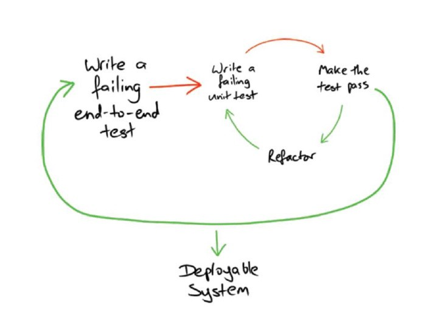
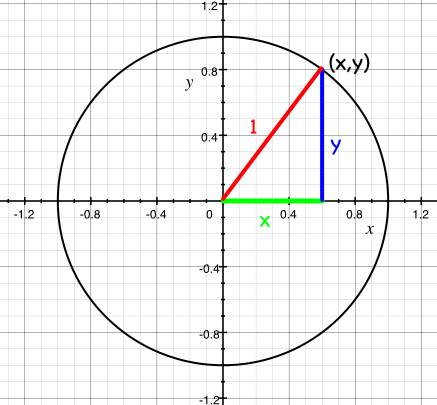
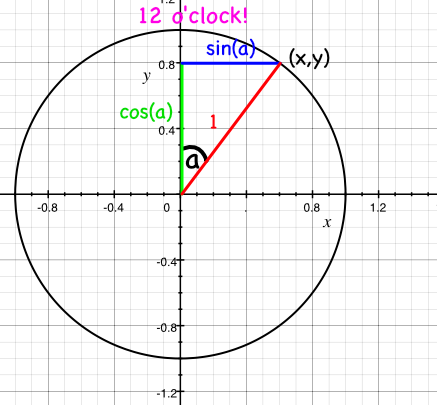

# Математика

[**Весь код для этой главы вы найдете здесь**](https://github.com/quii/learn-go-with-tests/tree/main/math)

Несмотря на всю мощь современных компьютеров, способных выполнять огромные вычисления с молниеносной скоростью, среднестатистический разработчик редко использует математику в своей работе. Но не сегодня! Сегодня мы будем использовать математику для решения _реальной_ проблемы. И не скучной математики — мы будем использовать тригонометрию, векторы и всевозможные вещи, о которых вы всегда говорили, что вам никогда не придется их использовать после школы.

## Задача

Вы хотите создать SVG-изображение часов. Не цифровых часов — нет, это было бы слишком просто — а _аналоговых_ часов со стрелками. Вы не ищете ничего причудливого, просто хорошую функцию, которая принимает `Time` из пакета `time` и выдает SVG-изображение часов со всеми стрелками — часовой, минутной и секундной — указывающими в верном направлении. Насколько это может быть сложно?

Сначала нам понадобится SVG часов, чтобы мы могли с ним поиграть. SVG — это фантастический формат изображений для программного манипулирования, потому что они написаны как серия фигур, описанных в XML. Итак, эти часы:


описываются так:

```xml
<?xml version="1.0" encoding="UTF-8" standalone="no"?>
<!DOCTYPE svg PUBLIC "-//W3C//DTD SVG 1.1//EN" "http://www.w3.org/Graphics/SVG/1.1/DTD/svg11.dtd">
<svg xmlns="http://www.w3.org/2000/svg"
     width="300"
     height="300"
     viewBox="0 0 300 300"
     version="2.0">

  <!-- bezel -->
  <circle cx="150" cy="150" r="100" style="fill:#fff;stroke:#000;stroke-width:5px;"/>

  <!-- hour hand -->
  <line x1="150" y1="150" x2="114.150000" y2="132.260000"
        style="fill:none;stroke:#000;stroke-width:7px;"/>

  <!-- minute hand -->
  <line x1="150" y1="150" x2="101.290000" y2="99.730000"
        style="fill:none;stroke:#000;stroke-width:7px;"/>

  <!-- second hand -->
  <line x1="150" y1="150" x2="77.190000" y2="202.900000"
        style="fill:none;stroke:#f00;stroke-width:3px;"/>
</svg>
```

Это круг с тремя линиями, каждая из которых начинается в середине круга (x=150, y=150) и заканчивается на некотором расстоянии.

Итак, мы собираемся каким-то образом восстановить вышеизложенное, но изменить линии так, чтобы они указывали в соответствующих направлениях для заданного времени.

## Приемочный тест

Прежде чем мы слишком углубимся, давайте подумаем о приемочном тесте.

Подождите, вы еще не знаете, что такое приемочный тест. Позвольте мне попробовать объяснить.

Позвольте спросить вас: как выглядит победа? Как мы узнаем, что закончили работу? TDD предоставляет хороший способ узнать, когда вы закончили: когда тест проходит. Иногда бывает приятно — на самом деле, почти всегда приятно — написать тест, который говорит вам, когда вы закончили писать всю используемую функцию. Не просто тест, который говорит вам, что определенная функция работает так, как вы ожидаете, а тест, который говорит вам, что вся вещь, которую вы пытаетесь достичь — 'функция' — завершена.

Эти тесты иногда называют 'приемочными тестами', иногда 'функциональными тестами'. Идея заключается в том, что вы пишете действительно высокоуровневый тест, чтобы описать, чего вы пытаетесь достичь — например, пользователь нажимает кнопку на веб-сайте и видит полный список пойманных им покемонов. Когда мы написали этот тест, мы можем написать больше тестов — модульных тестов, — которые будут строить работающую систему, которая пройдет приемочный тест. Так, для нашего примера эти тесты могут быть о рендеринге веб-страницы с кнопкой, тестировании обработчиков маршрутов на веб-сервере, выполнении запросов к базе данных и т.д. Все эти вещи будут разработаны с использованием TDD, и все они будут способствовать прохождению исходного приемочного теста.

Что-то вроде этой _классической_ картины Ната Прайса и Стива Фримена:



В любом случае, давайте попробуем написать этот приемочный тест — тот, который сообщит нам, когда мы закончим.

У нас есть пример часов, так что давайте подумаем, каковы будут важные параметры.

```
<line x1="150" y1="150" x2="114.150000" y2="132.260000"
        style="fill:none;stroke:#000;stroke-width:7px;"/>
```

Центр часов (атрибуты `x1` и `y1` для этой линии) одинаков для каждой стрелки часов. Числа, которые необходимо изменить для каждой стрелки часов — параметры для того, что создает SVG — это атрибуты `x2` и `y2`. Нам понадобятся X и Y для каждой из стрелок часов.

Я _мог_ бы подумать о большем количестве параметров — радиус циферблата, размер SVG, цвета стрелок, их форму и т.д., — но лучше начать с решения простой, конкретной проблемы простым, конкретным решением, а затем начать добавлять параметры, чтобы сделать его обобщенным.

Итак, мы скажем, что:

*   у каждых часов центр находится в (150, 150)
*   часовая стрелка длиной 50
*   минутная стрелка длиной 80
*   секундная стрелка длиной 90.

Что нужно отметить в SVG: начало координат — точка (0,0) — находится в _верхнем левом_ углу, а не в _нижнем левом_, как мы могли бы ожидать. Важно помнить об этом, когда мы будем вычислять, какие числа подставлять в наши линии.

Наконец, я не решаю, _как_ конструировать SVG — мы могли бы использовать шаблон из пакета [`text/template`](https://golang.org/pkg/text/template/) или просто отправлять байты в `bytes.Buffer` или `writer`. Но мы знаем, что нам понадобятся эти числа, поэтому давайте сосредоточимся на тестировании того, что их создает.

### Сначала пишем тест

Итак, мой первый тест выглядит так:

```go
package clockface_test

import (
	"projectpath/clockface"
	"testing"
	"time"
)

func TestSecondHandAtMidnight(t *testing.T) {
	tm := time.Date(1337, time.January, 1, 0, 0, 0, 0, time.UTC)

	want := clockface.Point{X: 150, Y: 150 - 90}
	got := clockface.SecondHand(tm)

	if got != want {
		t.Errorf("Got %v, wanted %v", got, want)
	}
}
```

`projectpath` здесь является плейсхолдером — замените его на путь вашего собственного модуля плюс `/clockface` (например, если ваш `go.mod` указывает `module example.com/learning-go`, этот импорт будет `"example.com/learning-go/clockface"`). Это работает потому, что мы помещаем `clockface_test.go` в собственную директорию с именем `clockface`, рядом с `clockface.go` (который мы создадим следующим). Называние директории в соответствии с именем пакета, который она содержит, означает, что Go может разрешить импорт без необходимости использования псевдонима. `package clockface_test` внутри той же директории — это особый случай, разрешенный Go: внешний тестовый пакет, который может находиться рядом с файлами `package clockface` в той же папке.

Помните, как SVG строит свои координаты из верхнего левого угла? Чтобы разместить секундную стрелку в полночь, мы ожидаем, что она не сдвинулась от центра циферблата по оси X — все еще 150 — а по оси Y находится длина стрелки 'вверх' от центра; 150 минус 90.

### Запускаем тест

Это приводит к ожидаемым ошибкам из-за отсутствующих функций и типов:

```
--- FAIL: TestSecondHandAtMidnight (0.00s)
./clockface_test.go:13:10: undefined: clockface.Point
./clockface_test.go:14:9: undefined: clockface.SecondHand
```

Итак, `Point`, куда должен указывать кончик секундной стрелки, и функция для ее получения.

### Пишем минимальный объем кода для запуска теста и проверяем вывод упавшего теста

Давайте реализуем эти типы, чтобы код скомпилировался:

```go
package clockface

import "time"

// A Point represents a two-dimensional Cartesian coordinate
type Point struct {
	X float64
	Y float64
}

// SecondHand is the unit vector of the second hand of an analogue clock at time `t`
// represented as a Point.
func SecondHand(t time.Time) Point {
	return Point{}
}
```

и теперь мы получаем:

```
--- FAIL: TestSecondHandAtMidnight (0.00s)
    clockface_test.go:17: Got {0 0}, wanted {150 60}
FAIL
exit status 1
FAIL	learn-go-with-tests/math/clockface	0.006s
```

### Пишем достаточно кода, чтобы тест прошел

Когда мы получаем ожидаемую ошибку, мы можем заполнить возвращаемое значение `SecondHand`:

```go
// SecondHand is the unit vector of the second hand of an analogue clock at time `t`
// represented as a Point.
func SecondHand(t time.Time) Point {
	return Point{150, 60}
}
```

Вот, прошедший тест.

```
PASS
ok  	    clockface	0.006s
```

### Рефакторинг

Пока не нужно рефакторить — кода почти нет!

### Повторяем для новых требований

Вероятно, нам нужно сделать здесь что-то, что не просто возвращает часы, показывающие полночь для любого времени...

### Сначала пишем тест

```go
func TestSecondHandAt30Seconds(t *testing.T) {
	tm := time.Date(1337, time.January, 1, 0, 0, 30, 0, time.UTC)

	want := clockface.Point{X: 150, Y: 150 + 90}
	got := clockface.SecondHand(tm)

	if got != want {
		t.Errorf("Got %v, wanted %v", got, want)
	}
}
```

Та же идея, но теперь секундная стрелка указывает _вниз_, поэтому мы _добавляем_ длину к оси Y.

Это скомпилируется... но как заставить это пройти?

## Время подумать

Как мы собираемся решить эту проблему?

Каждую минуту секундная стрелка проходит через 60 одинаковых состояний, указывая в 60 разных направлениях. Когда 0 секунд, она указывает на верх циферблата, когда 30 секунд, она указывает на низ циферблата. Достаточно просто.

Итак, если бы я хотел подумать, в каком направлении указывала секундная стрелка, скажем, на 37 секундах, я бы захотел найти угол между 12 часами и 37/60 оборота по кругу. В градусах это `(360 / 60) * 37 = 222`, но проще просто запомнить, что это `37/60` полного оборота.

Но угол — это только полдела; нам нужно знать X и Y координаты, на которые указывает кончик секундной стрелки. Как это вычислить?

## Математика

Представьте себе круг радиусом 1, нарисованный вокруг начала координат — координаты `0, 0`.


Это называется 'единичной окружностью', потому что... ну, радиус равен 1 единице!

Длина окружности состоит из точек на сетке — еще больше координат. X и Y компоненты каждой из этих координат образуют треугольник, гипотенуза которого всегда равна 1 (то есть радиусу окружности).



Теперь, тригонометрия позволит нам вычислить длины X и Y для каждого треугольника, если мы знаем угол, который они образуют с началом координат. Координата X будет cos(a), а координата Y будет sin(a), где a — это угол, образованный линией и (положительной) осью X.

.png>)

(Если вы не верите, [посмотрите на Википедии...](https://en.wikipedia.org/wiki/Sine#Unit_circle_definition))

Еще один последний поворот — поскольку мы хотим измерять угол от 12 часов, а не от оси X (3 часов), нам нужно поменять оси местами; теперь x = sin(a) и y = cos(a).



Итак, теперь мы знаем, как получить угол секундной стрелки (1/60 часть круга для каждой секунды) и X и Y координаты. Нам понадобятся функции как для `sin`, так и для `cos`.

## `math`

К счастью, пакет Go `math` содержит обе эти функции, с одной небольшой загвоздкой, которую нам нужно будет понять; если мы посмотрим на описание [`math.Cos`](https://golang.org/pkg/math/#Cos):

> Cos возвращает косинус радианного аргумента x.

Он хочет, чтобы угол был в радианах. Так что же такое радиан? Вместо того чтобы определять полный оборот круга как 360 градусов, мы определяем полный оборот как 2π радиан. Для этого есть веские причины, в которые мы не будем вдаваться.

Теперь, когда мы немного почитали, поучились и подумали, мы можем написать наш следующий тест.

### Сначала пишем тест

Вся эта математика сложна и запутанна. Я не уверен, что понимаю, что происходит — так что давайте напишем тест! Нам не нужно решать всю проблему за один раз — давайте начнем с вычисления правильного угла в радианах для секундной стрелки в определенное время.

Я собираюсь _закомментировать_ приемочный тест, над которым я работал, пока я работаю над этими тестами — я не хочу отвлекаться на этот тест, пока я добиваюсь прохождения этого.

### Краткое повторение о пакетах

В данный момент наши приемочные тесты находятся в пакете `clockface_test`. Наши тесты могут находиться за пределами пакета `clockface` — пока их имя заканчивается на `_test.go`, их можно запускать.

Я собираюсь написать эти тестов на радианы _внутри_ пакета `clockface`; они, возможно, никогда не будут экспортированы и могут быть удалены (или перемещены), как только я лучше разберусь в происходящем. Я переименую свой файл приемочного теста в `clockface_acceptance_test.go`, чтобы я мог создать _новый_ файл с именем `clockface_test` для тестирования секунд в радианах.

```go
package clockface

import (
	"math"
	"testing"
	"time"
)

func TestSecondsInRadians(t *testing.T) {
	thirtySeconds := time.Date(312, time.October, 28, 0, 0, 30, 0, time.UTC)
	want := math.Pi
	got := secondsInRadians(thirtySeconds)

	if want != got {
		t.Fatalf("Wanted %v radians, but got %v", want, got)
	}
}
```

Здесь мы тестируем, что 30 секунд после минуты должны поместить секундную стрелку на полпути вокруг часов. И это наше первое использование пакета `math`! Если полный оборот круга составляет 2π радиан, мы знаем, что половина оборота должна составлять просто π радиан. `math.Pi` предоставляет нам значение для π.

### Запускаем тест

```
./clockface_test.go:12:9: undefined: secondsInRadians
```

### Пишем минимальный объем кода для запуска теста и проверяем вывод упавшего теста

```go
func secondsInRadians(t time.Time) float64 {
	return 0
}
```

```
clockface_test.go:15: Wanted 3.141592653589793 radians, but got 0
```

### Пишем достаточно кода, чтобы тест прошел

```go
func secondsInRadians(t time.Time) float64 {
	return math.Pi
}
```

```
PASS
ok  	clockface	0.011s
```

### Рефакторинг

Пока ничего не требует рефакторинга.

### Повторяем для новых требований

Теперь мы можем расширить тест, чтобы охватить еще несколько сценариев. Я пропущу немного вперед и покажу уже рефакторенный тестовый код — должно быть достаточно понятно, как я пришел к желаемому.

```go
func TestSecondsInRadians(t *testing.T) {
	cases := []struct {
		time  time.Time
		angle float64
	}{
		{simpleTime(0, 0, 30), math.Pi},
		{simpleTime(0, 0, 0), 0},
		{simpleTime(0, 0, 45), (math.Pi / 2) * 3},
		{simpleTime(0, 0, 7), (math.Pi / 30) * 7},
	}

	for _, c := range cases {
		t.Run(testName(c.time), func(t *testing.T) {
			got := secondsInRadians(c.time)
			if got != c.angle {
				t.Fatalf("Wanted %v radians, but got %v", c.angle, got)
			}
		})
	}
}
```

Я добавил пару вспомогательных функций, чтобы написание этого табличного теста было немного менее утомительным. `testName` преобразует время в формат цифровых часов (ЧЧ:ММ:СС), а `simpleTime` создает `time.Time`, используя только те части, которые нам действительно важны (опять же, часы, минуты и секунды). Вот они:

```go
func simpleTime(hours, minutes, seconds int) time.Time {
	return time.Date(312, time.October, 28, hours, minutes, seconds, 0, time.UTC)
}

func testName(t time.Time) string {
	return t.Format("15:04:05")
}
```

Эти две функции должны помочь сделать эти тесты (и будущие тесты) немного проще в написании и поддержке.

Это дает нам хороший вывод теста:

```
clockface_test.go:24: Wanted 0 radians, but got 3.141592653589793

clockface_test.go:24: Wanted 4.71238898038469 radians, but got 3.141592653589793
```

Время реализовать всю ту математику, о которой мы говорили выше:

```go
func secondsInRadians(t time.Time) float64 {
	return float64(t.Second()) * (math.Pi / 30)
}
```

Одна секунда — это (2π / 60) радиан... сокращаем 2 и получаем π/30 радиан. Умножаем это на количество секунд (как `float64`), и теперь все тесты должны пройти...

```
clockface_test.go:24: Wanted 3.141592653589793 radians, but got 3.1415926535897936
```

Подождите, что?

### Плавающие точки — это ужасно

Арифметика с плавающей точкой [общеизвестно неточна](https://0.30000000000000004.com/). Компьютеры на самом деле могут обрабатывать только целые числа, и в некоторой степени рациональные числа. Десятичные числа начинают становиться неточными, особенно когда мы масштабируем их вверх и вниз, как это происходит в функции `secondsInRadians`. Разделив `math.Pi` на 30, а затем умножив на 30, мы получили _число, которое больше не равно `math.Pi`_.

Есть два способа обойти это:

1.  Жить с этим
2.  Рефакторинг нашей функции путем рефакторинга нашего уравнения

Теперь (1) может показаться не таким уж привлекательным, но зачастую это единственный способ заставить работать равенство с плавающей точкой. Неточность на какую-то бесконечно малую долю, честно говоря, не будет иметь значения для рисования циферблата, поэтому мы могли бы написать функцию, которая определяет "достаточно близкое" равенство для наших углов. Но есть простой способ вернуть точность: мы перестраиваем уравнение так, чтобы больше не делить вниз, а затем умножать вверх. Мы можем сделать все, просто разделив.

Так, вместо

```
numberOfSeconds * π / 30
```

мы можем написать

```
π / (30 / numberOfSeconds)
```

что эквивалентно.

В Go:

```go
func secondsInRadians(t time.Time) float64 {
	return (math.Pi / (30 / (float64(t.Second()))))
}
```

И мы получаем прохождение.

```
PASS
ok      clockface     0.005s
```

Все должно выглядеть [примерно так](https://github.com/quii/learn-go-with-tests/tree/main/math/v3/clockface).

### Заметка о делении на ноль

Компьютеры часто не любят деление на ноль, потому что бесконечность — это немного странно.

В Go, если вы попытаетесь явно разделить на ноль, вы получите ошибку компиляции.

```go
package main

import (
	"fmt"
)

func main() {
	fmt.Println(10.0 / 0.0) // fails to compile
}
```

Очевидно, компилятор не всегда может предсказать, что вы разделите на ноль, как в нашем `t.Second()`.

Попробуйте это:

```go
func main() {
	fmt.Println(10.0 / zero())
}

func zero() float64 {
	return 0.0
}
```

Он выведет `+Inf` (бесконечность). Деление на +Inf, кажется, приводит к нулю, и мы можем убедиться в этом с помощью следующего:

```go
package main

import (
	"fmt"
	"math"
)

func main() {
	fmt.Println(secondsinradians())
}

func zero() float64 {
	return 0.0
}

func secondsinradians() float64 {
	return (math.Pi / (30 / (float64(zero()))))
}
```

### Повторяем для новых требований

Итак, мы разобрались с первой частью — мы знаем, под каким углом в радианах будет указывать секундная стрелка. Теперь нам нужно выяснить координаты.

Опять же, давайте сделаем это максимально простым и будем работать только с _единичной окружностью_; окружностью радиусом 1. Это означает, что все наши стрелки будут иметь длину один, но, с другой стороны, это означает, что математика будет для нас легко усваиваемой.

### Сначала пишем тест

```go
func TestSecondHandPoint(t *testing.T) {
	cases := []struct {
		time  time.Time
		point Point
	}{
		{simpleTime(0, 0, 30), Point{0, -1}},
	}

	for _, c := range cases {
		t.Run(testName(c.time), func(t *testing.T) {
			got := secondHandPoint(c.time)
			if got != c.point {
				t.Fatalf("Wanted %v Point, but got %v", c.point, got)
			}
		})
	}
}
```

### Запускаем тест

```
./clockface_test.go:40:11: undefined: secondHandPoint
```

### Пишем минимальный объем кода для запуска теста и проверяем вывод упавшего теста

```go
func secondHandPoint(t time.Time) Point {
	return Point{}
}
```

```
clockface_test.go:42: Wanted {0 -1} Point, but got {0 0}
```

### Пишем достаточно кода, чтобы тест прошел

```go
func secondHandPoint(t time.Time) Point {
	return Point{0, -1}
}
```

```
PASS
ok  	clockface	0.007s
```

### Повторяем для новых требований

```go
func TestSecondHandPoint(t *testing.T) {
	cases := []struct {
		time  time.Time
		point Point
	}{
		{simpleTime(0, 0, 30), Point{0, -1}},
		{simpleTime(0, 0, 45), Point{-1, 0}},
	}

	for _, c := range cases {
		t.Run(testName(c.time), func(t *testing.T) {
			got := secondHandPoint(c.time)
			if got != c.point {
				t.Fatalf("Wanted %v Point, but got %v", c.point, got)
			}
		})
	}
}
```

### Запускаем тест

```
clockface_test.go:43: Wanted {-1 0} Point, but got {0 -1}
```

### Пишем достаточно кода, чтобы тест прошел

Помните нашу картинку с единичной окружностью?

.png>)

Также вспомним, что мы хотим измерять угол от 12 часов, то есть от оси Y, а не от оси X, что было бы равносильно измерению угла между секундной стрелкой и 3 часами.


Теперь нам нужно уравнение, которое дает X и Y. Давайте запишем его для секунд:

```go
func secondHandPoint(t time.Time) Point {
	angle := secondsInRadians(t)
	x := math.Sin(angle)
	y := math.Cos(angle)

	return Point{x, y}
}
```

Теперь мы получаем:

```
clockface_test.go:43: Wanted {0 -1} Point, but got {1.2246467991473515e-16 -1}

clockface_test.go:43: Wanted {-1 0} Point, but got {-1 -1.8369701987210272e-16}
```

Подождите, что (снова)? Похоже, мы снова прокляты плавающими точками — оба этих неожиданных числа _бесконечно малы_ — на 16-м знаке после запятой. Итак, снова мы можем либо попытаться увеличить точность, либо просто сказать, что они примерно равны, и продолжить нашу жизнь.

Один из вариантов увеличения точности этих углов — использование рационального типа `Rat` из пакета `math/big`. Но учитывая, что цель — нарисовать SVG, а не высадиться на Луну, я думаю, мы можем смириться с некоторой неточностью.

```go
func TestSecondHandPoint(t *testing.T) {
	cases := []struct {
		time  time.Time
		point Point
	}{
		{simpleTime(0, 0, 30), Point{0, -1}},
		{simpleTime(0, 0, 45), Point{-1, 0}},
	}

	for _, c := range cases {
		t.Run(testName(c.time), func(t *testing.T) {
			got := secondHandPoint(c.time)
			if !roughlyEqualPoint(got, c.point) {
				t.Fatalf("Wanted %v Point, but got %v", c.point, got)
			}
		})
	}
}

func roughlyEqualFloat64(a, b float64) bool {
	const equalityThreshold = 1e-7
	return math.Abs(a-b) < equalityThreshold
}

func roughlyEqualPoint(a, b Point) bool {
	return roughlyEqualFloat64(a.X, b.X) &&
		roughlyEqualFloat64(a.Y, b.Y)
}
```

Мы определили две функции для определения приблизительного равенства между двумя `Point` — они будут работать, если элементы X и Y находятся в пределах 0.0000001 друг от друга. Это все еще довольно точно.

И теперь мы получаем:

```
PASS
ok  	clockface	0.007s
```

### Рефакторинг

Я по-прежнему очень доволен этим.

Вот [как это выглядит сейчас](https://github.com/quii/learn-go-with-tests/tree/main/math/v4/clockface).

### Повторяем для новых требований

Ну, говорить _новые_ не совсем точно — на самом деле, теперь мы можем заставить этот приемочный тест пройти! Давайте напомним себе, как он выглядит:

```go
func TestSecondHandAt30Seconds(t *testing.T) {
	tm := time.Date(1337, time.January, 1, 0, 0, 30, 0, time.UTC)

	want := clockface.Point{X: 150, Y: 150 + 90}
	got := clockface.SecondHand(tm)

	if got != want {
		t.Errorf("Got %v, wanted %v", got, want)
	}
}
```

### Запускаем тест

```
clockface_acceptance_test.go:28: Got {150 60}, wanted {150 240}
```

### Пишем достаточно кода, чтобы тест прошел

Нам нужно сделать три вещи, чтобы преобразовать наш единичный вектор в точку на SVG:

1.  Масштабировать его до длины стрелки
2.  Перевернуть его по оси X, чтобы учесть, что SVG имеет начало координат в верхнем левом углу
3.  Переместить его в правильное положение (чтобы оно исходило из начала координат (150,150))

Веселые времена!

```go
// SecondHand is the unit vector of the second hand of an analogue clock at time `t`
// represented as a Point.
func SecondHand(t time.Time) Point {
	p := secondHandPoint(t)
	p = Point{p.X * 90, p.Y * 90}   // scale
	p = Point{p.X, -p.Y}            // flip
	p = Point{p.X + 150, p.Y + 150} // translate
	return p
}
```

Масштабирование, переворот и перемещение именно в таком порядке. Ура, математика!

```
PASS
ok  	clockface	0.007s
```

### Рефакторинг

Здесь есть несколько магических чисел, которые следует вынести в константы, так что давайте это сделаем:

```go
const secondHandLength = 90
const clockCentreX = 150
const clockCentreY = 150

// SecondHand is the unit vector of the second hand of an analogue clock at time `t`
// represented as a Point.
func SecondHand(t time.Time) Point {
	p := secondHandPoint(t)
	p = Point{p.X * secondHandLength, p.Y * secondHandLength}
	p = Point{p.X, -p.Y}
	p = Point{p.X + clockCentreX, p.Y + clockCentreY} //translate
	return p
}
```

## Рисуем часы

Ну... во всяком случае, секундную стрелку...

Давайте сделаем это — потому что нет ничего хуже, чем не предоставить какую-либо ценность, когда она просто ждет, чтобы выйти в мир и ослепить людей. Давайте нарисуем секундную стрелку!

Мы поместим новую директорию внутри нашей основной директории пакета `clockface`, названную (что сбивает с толку) `clockface`. В ней мы поместим пакет `main`, который создаст исполняемый файл, который будет строить SVG:

```
|-- clockface
|       |-- main.go
|-- clockface.go
|-- clockface_acceptance_test.go
|-- clockface_test.go
```

Внутри `main.go` вы начнете с этого кода, но измените импорт пакета `clockface`, чтобы он указывал на вашу собственную версию:

```go
package main

import (
	"fmt"
	"io"
	"os"
	"time"

	"learn-go-with-tests/math/clockface" // REPLACE THIS!
)

func main() {
	t := time.Now()
	sh := clockface.SecondHand(t)
	io.WriteString(os.Stdout, svgStart)
	io.WriteString(os.Stdout, bezel)
	io.WriteString(os.Stdout, secondHandTag(sh))
	io.WriteString(os.Stdout, svgEnd)
}

func secondHandTag(p clockface.Point) string {
	return fmt.Sprintf(`<line x1="150" y1="150" x2="%f" y2="%f" style="fill:none;stroke:#f00;stroke-width:3px;"/>`, p.X, p.Y)
}

const svgStart = `<?xml version="1.0" encoding="UTF-8" standalone="no"?>
<!DOCTYPE svg PUBLIC "-//W3C//DTD SVG 1.1//EN" "http://www.w3.org/Graphics/SVG/1.1/DTD/svg11.dtd">
<svg xmlns="http://www.w3.org/2000/svg"
     width="100%"
     height="100%"
     viewBox="0 0 300 300"
     version="2.0">`

const bezel = `<circle cx="150" cy="150" r="100" style="fill:#fff;stroke:#000;stroke-width:5px;"/>`

const svgEnd = `</svg>`
```

О, боже, я не собираюсь выигрывать призы за красивый код с этим беспорядком — но он делает свою работу. Он записывает SVG в `os.Stdout` — по одной строке за раз.

Если мы скомпилируем это:

```
go build
```

и запустим, отправляя вывод в файл:

```
./clockface > clock.svg
```

Мы должны увидеть что-то вроде:


И вот [как выглядит код](https://github.com/quii/learn-go-with-tests/tree/main/math/v6/clockface).

### Рефакторинг

Это плохо пахнет. Ну, не то чтобы совсем _плохо_ пахнет, но я этим недоволен.

1.  Вся эта функция `SecondHand` _очень_ сильно привязана к SVG... не упоминая SVG и фактически не производя SVG...
2.  ... в то же время я не тестирую ни один из своих SVG-кодов.

Да, я думаю, я облажался. Это неправильно. Давайте попробуем исправиться с помощью более SVG-ориентированного теста.

Какие у нас есть варианты? Ну, мы могли бы попытаться протестировать, что символы, исходящие из `SVGWriter`, содержат вещи, похожие на теги SVG, которые мы ожидаем для определенного времени. Например:

```go
func TestSVGWriterAtMidnight(t *testing.T) {
	tm := time.Date(1337, time.January, 1, 0, 0, 0, 0, time.UTC)

	var b strings.Builder
	clockface.SVGWriter(&b, tm)
	got := b.String()

	want := `<line x1="150" y1="150" x2="150" y2="60"`

	if !strings.Contains(got, want) {
		t.Errorf("Expected to find the second hand %v, in the SVG output %v", want, got)
	}
}
```

Но разве это действительно улучшение?

Мало того, что он все равно пройдет, если я не создам действительный SVG (поскольку он проверяет только то, что строка появляется в выводе), так он еще и упадет, если я внесу малейшее, неважное изменение в эту строку — например, если я добавлю лишний пробел между атрибутами.

_Самый большой_ "запах" заключается в том, что я тестирую структуру данных — XML — рассматривая ее представление в виде последовательности символов — в виде строки. Это _никогда_, _никогда_ не является хорошей идеей, так как это приводит к проблемам, подобным тем, что я описал выше: тест, который одновременно слишком хрупкий и недостаточно чувствительный. Тест, который тестирует неправильное!

Так что единственное решение — тестировать вывод _как XML_. И для этого нам понадобится его распарсить.

## Парсинг XML

[`encoding/xml`](https://pkg.go.dev/encoding/xml) — это пакет Go, который может обрабатывать все, что связано с простым парсингом XML.

Функция [`xml.Unmarshal`](https://pkg.go.dev/encoding/xml#Unmarshal) принимает `[]byte` XML-данных и указатель на структуру, в которую они должны быть распакованы.

Итак, нам понадобится структура, в которую мы будем распаковывать наш XML. Мы могли бы потратить некоторое время на выяснение правильных имен для всех узлов и атрибутов, и как написать правильную структуру, но, к счастью, кто-то написал [`zek`](https://github.com/miku/zek) — программу, которая автоматизирует всю эту тяжелую работу за нас. Более того, есть онлайн-версия по адресу [https://xml-to-go.github.io/](https://xml-to-go.github.io/). Просто вставьте SVG из верхней части файла в одно поле и — бац — получите:

```go
type Svg struct {
	XMLName xml.Name `xml:"svg"`
	Text    string   `xml:",chardata"`
	Xmlns   string   `xml:"xmlns,attr"`
	Width   string   `xml:"width,attr"`
	Height  string   `xml:"height,attr"`
	ViewBox string   `xml:"viewBox,attr"`
	Version string   `xml:"version,attr"`
	Circle  struct {
		Text  string `xml:",chardata"`
		Cx    string `xml:"cx,attr"`
		Cy    string `xml:"cy,attr"`
		R     string `xml:"r,attr"`
		Style string `xml:"style,attr"`
	} `xml:"circle"`
	Line []struct {
		Text  string `xml:",chardata"`
		X1    string `xml:"x1,attr"`
		Y1    string `xml:"y1,attr"`
		X2    string `xml:"x2,attr"`
		Y2    string `xml:"y2,attr"`
		Style string `xml:"style,attr"`
	} `xml:"line"`
}
```

Мы могли бы внести корректировки в эту структуру, если бы это было необходимо (например, изменить имя структуры на `SVG`), но ее определенно достаточно, чтобы начать работу. Вставьте структуру в файл `clockface_acceptance_test` и давайте напишем с ней тест:

```go
func TestSVGWriterAtMidnight(t *testing.T) {
	tm := time.Date(1337, time.January, 1, 0, 0, 0, 0, time.UTC)

	b := bytes.Buffer{}
	clockface.SVGWriter(&b, tm)

	svg := Svg{}
	xml.Unmarshal(b.Bytes(), &svg)

	x2 := "150"
	y2 := "60"

	for _, line := range svg.Line {
		if line.X2 == x2 && line.Y2 == y2 {
			return
		}
	}

	t.Errorf("Expected to find the second hand with x2 of %+v and y2 of %+v, in the SVG output %v", x2, y2, b.String())
}
```

Мы записываем вывод `clockface.SVGWriter` в `bytes.Buffer`, а затем распаковываем его в `Svg`. Затем мы просматриваем каждую `Line` в `Svg`, чтобы узнать, есть ли у какой-либо из них ожидаемые значения `X2` и `Y2`. Если мы находим совпадение, мы возвращаемся рано (тест проходит); если нет, мы завершаемся с (надеемся) информативным сообщением.

```sh
./clockface_acceptance_test.go:41:2: undefined: clockface.SVGWriter
```

Похоже, нам лучше создать `SVGWriter.go`...

```go
package clockface

import (
	"fmt"
	"io"
	"time"
)

const (
	secondHandLength = 90
	clockCentreX     = 150
	clockCentreY     = 150
)

// SVGWriter writes an SVG representation of an analogue clock, showing the time t, to the writer w
func SVGWriter(w io.Writer, t time.Time) {
	io.WriteString(w, svgStart)
	io.WriteString(w, bezel)
	secondHand(w, t)
	io.WriteString(w, svgEnd)
}

func secondHand(w io.Writer, t time.Time) {
	p := secondHandPoint(t)
	p = Point{p.X * secondHandLength, p.Y * secondHandLength} // scale
	p = Point{p.X, -p.Y}                                      // flip
	p = Point{p.X + clockCentreX, p.Y + clockCentreY}         // translate
	fmt.Fprintf(w, `<line x1="150" y1="150" x2="%.3f" y2="%.3f" style="fill:none;stroke:#f00;stroke-width:3px;"/>`, p.X, p.Y)
}

const svgStart = `<?xml version="1.0" encoding="UTF-8" standalone="no"?>
<!DOCTYPE svg PUBLIC "-//W3C//DTD SVG 1.1//EN" "http://www.w3.org/Graphics/SVG/1.1/DTD/svg11.dtd">
<svg xmlns="http://www.w3.org/2000/svg"
     width="100%"
     height="100%"
     viewBox="0 0 300 300"
     version="2.0">`

const bezel = `<circle cx="150" cy="150" r="100" style="fill:#fff;stroke:#000;stroke-width:5px;"/>`

const svgEnd = `</svg>`
```

Самый красивый SVG-писатель? Нет. Но, надеюсь, он справится с работой...

```
clockface_acceptance_test.go:56: Expected to find the second hand with x2 of 150 and y2 of 60, in the SVG output <?xml version="1.0" encoding="UTF-8" standalone="no"?>
    <!DOCTYPE svg PUBLIC "-//W3C//DTD SVG 1.1//EN" "http://www.w3.org/Graphics/SVG/1.1/DTD/svg11.dtd">
    <svg xmlns="http://www.w3.org/2000/svg"
         width="100%"
         height="100%"
         viewBox="0 0 300 300"
         version="2.0"><circle cx="150" cy="150" r="100" style="fill:#fff;stroke:#000;stroke-width:5px;"/><line x1="150" y1="150" x2="150.000000" y2="60.000000" style="fill:none;stroke:#f00;stroke-width:3px;"/></svg>
```

Ой! Директива формата `%f` выводит наши координаты с уровнем точности по умолчанию — шесть десятичных знаков. Мы должны явно указать, какой уровень точности мы ожидаем для координат. Скажем, три десятичных знака.

```go
	fmt.Fprintf(w, `<line x1="150" y1="150" x2="%.3f" y2="%.3f" style="fill:none;stroke:#f00;stroke-width:3px;"/>`, p.X, p.Y)
```

И после того, как мы обновим наши ожидания в тесте:

```go
	x2 := "150.000"
	y2 := "60.000"
```

Мы получаем:

```
PASS
ok  	clockface	0.006s
```

Теперь мы можем сократить нашу функцию `main`:

```go
package main

import (
	"os"
	"time"

	"learn-go-with-tests/math/clockface"
)

func main() {
	t := time.Now()
	clockface.SVGWriter(os.Stdout, t)
}
```

Вот [как это должно выглядеть сейчас](https://github.com/quii/learn-go-with-tests/tree/main/math/v7b/clockface).

И мы можем написать тест для другого времени, следуя тому же шаблону, но не раньше, чем...

### Рефакторинг

Выделяются три момента:

1.  Мы на самом деле не тестируем всю необходимую информацию, которую нужно обеспечить — что насчет значений `x1`, например?
2.  Также эти атрибуты для `x1` и т.д. на самом деле не `string`, не так ли? Это числа!
3.  Действительно ли меня заботит `style` стрелки? Или, если на то пошло, пустой узел `Text`, который был сгенерирован `zak`?

Мы можем сделать лучше. Давайте внесем несколько корректировок в структуру `Svg` и тесты, чтобы все уточнить.

```go
type SVG struct {
	XMLName xml.Name `xml:"svg"`
	Xmlns   string   `xml:"xmlns,attr"`
	Width   string   `xml:"width,attr"`
	Height  string   `xml:"height,attr"`
	ViewBox string   `xml:"viewBox,attr"`
	Version string   `xml:"version,attr"`
	Circle  Circle   `xml:"circle"`
	Line    []Line   `xml:"line"`
}

type Circle struct {
	Cx float64 `xml:"cx,attr"`
	Cy float64 `xml:"cy,attr"`
	R  float64 `xml:"r,attr"`
}

type Line struct {
	X1 float64 `xml:"x1,attr"`
	Y1 float64 `xml:"y1,attr"`
	X2 float64 `xml:"x2,attr"`
	Y2 float64 `xml:"y2,attr"`
}
```

Здесь я:

*   Сделал важные части структуры именованными типами — `Line` и `Circle`.
*   Преобразовал числовые атрибуты в `float64` вместо `string`.
*   Удалил неиспользуемые атрибуты, такие как `Style` и `Text`.
*   Переименовал `Svg` в `SVG`, потому что _так правильно_.

Это позволит нам более точно проверить искомую линию:

```go
func TestSVGWriterAtMidnight(t *testing.T) {
	tm := time.Date(1337, time.January, 1, 0, 0, 0, 0, time.UTC)
	b := bytes.Buffer{}

	clockface.SVGWriter(&b, tm)

	svg := SVG{}

	xml.Unmarshal(b.Bytes(), &svg)

	want := Line{150, 150, 150, 60}

	for _, line := range svg.Line {
		if line == want {
			return
		}
	}

	t.Errorf("Expected to find the second hand line %+v, in the SVG lines %+v", want, svg.Line)
}
```

Наконец, мы можем взять пример из таблиц модульных тестов и написать вспомогательную функцию `containsLine(line Line, lines []Line) bool`, чтобы эти тесты действительно засияли. Мы снова обратимся к `simpleTime` и `testName` — но этот файл (`clockface_acceptance_test.go`) находится в `package clockface_test`, отдельном пакете от файла `clockface_test.go`, в котором мы их изначально написали (`package clockface`). Поскольку они неэкспортированы, они не видны за пределами пакета, в котором они были объявлены, поэтому нам нужны свои собственные копии здесь.

```go
func TestSVGWriterSecondHand(t *testing.T) {
	cases := []struct {
		time time.Time
		line Line
	}{
		{
			simpleTime(0, 0, 0),
			Line{150, 150, 150, 60},
		},
		{
			simpleTime(0, 0, 30),
			Line{150, 150, 150, 240},
		},
	}

	for _, c := range cases {
		t.Run(testName(c.time), func(t *testing.T) {
			b := bytes.Buffer{}
			clockface.SVGWriter(&b, c.time)

			svg := SVG{}
			xml.Unmarshal(b.Bytes(), &svg)

			if !containsLine(c.line, svg.Line) {
				t.Errorf("Expected to find the second hand line %+v, in the SVG lines %+v", c.line, svg.Line)
			}
		})
	}
}

func containsLine(l Line, ls []Line) bool {
	for _, line := range ls {
		if line == l {
			return true
		}
	}
	return false
}

func simpleTime(hours, minutes, seconds int) time.Time {
	return time.Date(312, time.October, 28, hours, minutes, seconds, 0, time.UTC)
}

func testName(t time.Time) string {
	return t.Format("15:04:05")
}
```

Вот [как это выглядит](https://github.com/quii/learn-go-with-tests/tree/main/math/v7c/clockface).

Вот это я называю приемочным тестом!

### Сначала пишем тест

Итак, секундная стрелка готова. Теперь приступим к минутной стрелке.

```go
func TestSVGWriterMinuteHand(t *testing.T) {
	cases := []struct {
		time time.Time
		line Line
	}{
		{
			simpleTime(0, 0, 0),
			Line{150, 150, 150, 70},
		},
	}

	for _, c := range cases {
		t.Run(testName(c.time), func(t *testing.T) {
			b := bytes.Buffer{}
			clockface.SVGWriter(&b, c.time)

			svg := SVG{}
			xml.Unmarshal(b.Bytes(), &svg)

			if !containsLine(c.line, svg.Line) {
				t.Errorf("Expected to find the minute hand line %+v, in the SVG lines %+v", c.line, svg.Line)
			}
		})
	}
}
```

### Запускаем тест

```
clockface_acceptance_test.go:87: Expected to find the minute hand line {X1:150 Y1:150 X2:150 Y2:70}, in the SVG lines [{X1:150 Y1:150 X2:150 Y2:60}]
```

Нам лучше начать создавать другие стрелки часов. Подобно тому, как мы создавали тесты для секундной стрелки, мы можем итерировать, чтобы создать следующий набор тестов. Опять же, мы закомментируем наш приемочный тест, пока не заставим это работать:

```go
func TestMinutesInRadians(t *testing.T) {
	cases := []struct {
		time  time.Time
		angle float64
	}{
		{simpleTime(0, 30, 0), math.Pi},
	}

	for _, c := range cases {
		t.Run(testName(c.time), func(t *testing.T) {
			got := minutesInRadians(c.time)
			if got != c.angle {
				t.Fatalf("Wanted %v radians, but got %v", c.angle, got)
			}
		})
	}
}
```

### Запускаем тест

```
./clockface_test.go:59:11: undefined: minutesInRadians
```

### Пишем минимальный объем кода для запуска теста и проверяем вывод упавшего теста

```go
func minutesInRadians(t time.Time) float64 {
	return math.Pi
}
```

### Повторяем для новых требований

Что ж, ладно — теперь давайте заставим себя поработать _по-настоящему_. Мы могли бы смоделировать минутную стрелку так, чтобы она двигалась только каждую полную минуту — чтобы она 'перескакивала' с 30 на 31 минуту, не двигаясь между ними. Но это выглядело бы немного убого. Мы хотим, чтобы она двигалась _совсем по чуть-чуть_ каждую секунду.

```go
func TestMinutesInRadians(t *testing.T) {
	cases := []struct {
		time  time.Time
		angle float64
	}{
		{simpleTime(0, 30, 0), math.Pi},
		{simpleTime(0, 0, 7), 7 * (math.Pi / (30 * 60))},
	}

	for _, c := range cases {
		t.Run(testName(c.time), func(t *testing.T) {
			got := minutesInRadians(c.time)
			if got != c.angle {
				t.Fatalf("Wanted %v radians, but got %v", c.angle, got)
			}
		})
	}
}
```

Насколько это "совсем по чуть-чуть"? Ну...

*   Шестьдесят секунд в минуте
*   Тридцать минут в пол-оборота круга (`math.Pi` радиан)
*   Так что `30 * 60` секунд в пол-оборота.
*   Если время 7 секунд после часа...
*   ...мы ожидаем, что минутная стрелка будет на `7 * (math.Pi / (30 * 60))` радиан после 12.

### Запускаем тест

```
clockface_test.go:62: Wanted 0.012217304763960306 radians, but got 3.141592653589793
```

### Пишем достаточно кода, чтобы тест прошел

Бессмертными словами Дженнифер Энистон: [А теперь научная часть](https://www.youtube.com/watch?v=29Im23SPNok)

```go
func minutesInRadians(t time.Time) float64 {
	return (secondsInRadians(t) / 60) +
		(math.Pi / (30 / float64(t.Minute())))
}
```

Вместо того чтобы с нуля вычислять, насколько сильно нужно сдвинуть минутную стрелку по циферблату за каждую секунду, здесь мы можем просто использовать функцию `secondsInRadians`. За каждую секунду минутная стрелка будет двигаться на 1/60 часть угла, на который движется секундная стрелка.

```go
secondsInRadians(t) / 60
```

Затем мы просто добавляем движение для минут — аналогично движению секундной стрелки.

```go
math.Pi / (30 / float64(t.Minute()))
```

И...

```
PASS
ok  	clockface	0.007s
```

Легко и просто. Вот [как это выглядит сейчас](https://github.com/quii/learn-go-with-tests/tree/main/math/v8/clockface/clockface_acceptance_test.go).

### Повторяем для новых требований

Должен ли я добавить больше случаев в тест `minutesInRadians`? В данный момент их всего два. Сколько случаев мне нужно, прежде чем я перейду к тестированию функции `minuteHandPoint`?

Одна из моих любимых цитат о TDD, часто приписываемая Кенту Беку, звучит так:

> Пишите тесты, пока страх не превратится в скуку.

И, честно говоря, мне надоело тестировать эту функцию. Я уверен, что знаю, как она работает. Так что переходим к следующей.

### Сначала пишем тест

```go
func TestMinuteHandPoint(t *testing.T) {
	cases := []struct {
		time  time.Time
		point Point
	}{
		{simpleTime(0, 30, 0), Point{0, -1}},
	}

	for _, c := range cases {
		t.Run(testName(c.time), func(t *testing.T) {
			got := minuteHandPoint(c.time)
			if !roughlyEqualPoint(got, c.point) {
				t.Fatalf("Wanted %v Point, but got %v", c.point, got)
			}
		})
	}
}
```

### Запускаем тест

```
./clockface_test.go:79:11: undefined: minuteHandPoint
```

### Пишем минимальный объем кода для запуска теста и проверяем вывод упавшего теста

```go
func minuteHandPoint(t time.Time) Point {
	return Point{}
}
```

```
clockface_test.go:80: Wanted {0 -1} Point, but got {0 0}
```

### Пишем достаточно кода, чтобы тест прошел

```go
func minuteHandPoint(t time.Time) Point {
	return Point{0, -1}
}
```

```
PASS
ok  	clockface	0.007s
```

### Повторяем для новых требований

А теперь к настоящей работе:

```go
func TestMinuteHandPoint(t *testing.T) {
	cases := []struct {
		time  time.Time
		point Point
	}{
		{simpleTime(0, 30, 0), Point{0, -1}},
		{simpleTime(0, 45, 0), Point{-1, 0}},
	}

	for _, c := range cases {
		t.Run(testName(c.time), func(t *testing.T) {
			got := minuteHandPoint(c.time)
			if !roughlyEqualPoint(got, c.point) {
				t.Fatalf("Wanted %v Point, but got %v", c.point, got)
			}
		})
	}
}
```

```
clockface_test.go:81: Wanted {-1 0} Point, but got {0 -1}
```

### Пишем достаточно кода, чтобы тест прошел

Быстрое копирование и вставка функции `secondHandPoint` с некоторыми небольшими изменениями должно сработать...

```go
func minuteHandPoint(t time.Time) Point {
	angle := minutesInRadians(t)
	x := math.Sin(angle)
	y := math.Cos(angle)

	return Point{x, y}
}
```

```
PASS
ok  	clockface	0.009s
```

### Рефакторинг

У нас определенно есть некоторое дублирование в `minuteHandPoint` и `secondHandPoint` — я знаю, потому что мы только что скопировали и вставили одну функцию, чтобы создать другую. Давайте устраним дублирование с помощью функции.

```go
func angleToPoint(angle float64) Point {
	x := math.Sin(angle)
	y := math.Cos(angle)

	return Point{x, y}
}
```

и мы можем переписать `minuteHandPoint` и `secondHandPoint` одной строкой:

```go
func minuteHandPoint(t time.Time) Point {
	return angleToPoint(minutesInRadians(t))
}
```

```go
func secondHandPoint(t time.Time) Point {
	return angleToPoint(secondsInRadians(t))
}
```

```
PASS
ok  	clockface	0.007s
```

Теперь мы можем раскомментировать приемочный тест и приступить к рисованию минутной стрелки.

### Пишем достаточно кода, чтобы тест прошел

Функция `minuteHand` — это копия функции `secondHand` с некоторыми небольшими корректировками, такими как объявление `minuteHandLength`:

```go
const minuteHandLength = 80

//...

func minuteHand(w io.Writer, t time.Time) {
	p := makeHand(minuteHandPoint(t), minuteHandLength)
	fmt.Fprintf(w, `<line x1="150" y1="150" x2="%.3f" y2="%.3f" style="fill:none;stroke:#000;stroke-width:3px;"/>`, p.X, p.Y)
}
```

И вызов ее в нашей функции `SVGWriter`:

```go
func SVGWriter(w io.Writer, t time.Time) {
	io.WriteString(w, svgStart)
	io.WriteString(w, bezel)
	secondHand(w, t)
	minuteHand(w, t)
	io.WriteString(w, svgEnd)
}
```

Теперь мы должны увидеть, что `TestSVGWriterMinuteHand` проходит:

```
PASS
ok  	clockface	0.006s
```

Но доказательство пудинга — в том, чтобы его съесть — если мы теперь скомпилируем и запустим нашу программу `clockface`, мы должны увидеть что-то вроде:

.svg>)

### Рефакторинг

Давайте уберем дублирование из функций `secondHand` и `minuteHand`, поместив всю эту логику масштабирования, переворота и перемещения в одно место.

```go
func secondHand(w io.Writer, t time.Time) {
	p := makeHand(secondHandPoint(t), secondHandLength)
	fmt.Fprintf(w, `<line x1="150" y1="150" x2="%.3f" y2="%.3f" style="fill:none;stroke:#f00;stroke-width:3px;"/>`, p.X, p.Y)
}

func minuteHand(w io.Writer, t time.Time) {
	p := makeHand(minuteHandPoint(t), minuteHandLength)
	fmt.Fprintf(w, `<line x1="150" y1="150" x2="%.3f" y2="%.3f" style="fill:none;stroke:#000;stroke-width:3px;"/>`, p.X, p.Y)
}

func makeHand(p Point, length float64) Point {
	p = Point{p.X * length, p.Y * length}
	p = Point{p.X, -p.Y}
	return Point{p.X + clockCentreX, p.Y + clockCentreY}
}
```

```
PASS
ok  	clockface	0.007s
```

Вот [на чем мы сейчас остановились](https://github.com/quii/learn-go-with-tests/tree/main/math/v9/clockface).

Готово... теперь осталось только часовую стрелку!

### Сначала пишем тест

```go
func TestSVGWriterHourHand(t *testing.T) {
	cases := []struct {
		time time.Time
		line Line
	}{
		{
			simpleTime(6, 0, 0),
			Line{150, 150, 150, 200},
		},
	}

	for _, c := range cases {
		t.Run(testName(c.time), func(t *testing.T) {
			b := bytes.Buffer{}
			clockface.SVGWriter(&b, c.time)

			svg := SVG{}
			xml.Unmarshal(b.Bytes(), &svg)

			if !containsLine(c.line, svg.Line) {
				t.Errorf("Expected to find the hour hand line %+v, in the SVG lines %+v", c.line, svg.Line)
			}
		})
	}
}
```

### Запускаем тест

```
clockface_acceptance_test.go:113: Expected to find the hour hand line {X1:150 Y1:150 X2:150 Y2:200}, in the SVG lines [{X1:150 Y1:150 X2:150 Y2:60} {X1:150 Y1:150 X2:150 Y2:70}]
```

Опять же, давайте закомментируем этот, пока не получим некоторое покрытие низкоуровневыми тестами:

### Сначала пишем тест

```go
func TestHoursInRadians(t *testing.T) {
	cases := []struct {
		time  time.Time
		angle float64
	}{
		{simpleTime(6, 0, 0), math.Pi},
	}

	for _, c := range cases {
		t.Run(testName(c.time), func(t *testing.T) {
			got := hoursInRadians(c.time)
			if got != c.angle {
				t.Fatalf("Wanted %v radians, but got %v", c.angle, got)
			}
		})
	}
}
```

### Запускаем тест

```
./clockface_test.go:97:11: undefined: hoursInRadians
```

### Пишем минимальный объем кода для запуска теста и проверяем вывод упавшего теста

```go
func hoursInRadians(t time.Time) float64 {
	return math.Pi
}
```

```
PASS
ok  	clockface	0.007s
```

### Повторяем для новых требований

```go
func TestHoursInRadians(t *testing.T) {
	cases := []struct {
		time  time.Time
		angle float64
	}{
		{simpleTime(6, 0, 0), math.Pi},
		{simpleTime(0, 0, 0), 0},
	}

	for _, c := range cases {
		t.Run(testName(c.time), func(t *testing.T) {
			got := hoursInRadians(c.time)
			if got != c.angle {
				t.Fatalf("Wanted %v radians, but got %v", c.angle, got)
			}
		})
	}
}
```

### Запускаем тест

```
clockface_test.go:100: Wanted 0 radians, but got 3.141592653589793
```

### Пишем достаточно кода, чтобы тест прошел

```go
func hoursInRadians(t time.Time) float64 {
	return (math.Pi / (6 / float64(t.Hour())))
}
```

### Повторяем для новых требований

```go
func TestHoursInRadians(t *testing.T) {
	cases := []struct {
		time  time.Time
		angle float64
	}{
		{simpleTime(6, 0, 0), math.Pi},
		{simpleTime(0, 0, 0), 0},
		{simpleTime(21, 0, 0), math.Pi * 1.5},
	}

	for _, c := range cases {
		t.Run(testName(c.time), func(t *testing.T) {
			got := hoursInRadians(c.time)
			if got != c.angle {
				t.Fatalf("Wanted %v radians, but got %v", c.angle, got)
			}
		})
	}
}
```

### Запускаем тест

```
clockface_test.go:101: Wanted 4.71238898038469 radians, but got 10.995574287564276
```

### Пишем достаточно кода, чтобы тест прошел

```go
func hoursInRadians(t time.Time) float64 {
	return (math.Pi / (6 / (float64(t.Hour() % 12))))
}
```

Помните, это не 24-часовые часы; мы должны использовать оператор остатка, чтобы получить остаток от текущего часа, деленного на 12.

```
PASS
ok  	learn-go-with-tests/math/clockface	0.008s
```

### Сначала пишем тест

Теперь давайте попробуем переместить часовую стрелку по циферблату на основе прошедших минут и секунд.

```go
func TestHoursInRadians(t *testing.T) {
	cases := []struct {
		time  time.Time
		angle float64
	}{
		{simpleTime(6, 0, 0), math.Pi},
		{simpleTime(0, 0, 0), 0},
		{simpleTime(21, 0, 0), math.Pi * 1.5},
		{simpleTime(0, 1, 30), math.Pi / ((6 * 60 * 60) / 90)},
	}

	for _, c := range cases {
		t.Run(testName(c.time), func(t *testing.T) {
			got := hoursInRadians(c.time)
			if got != c.angle {
				t.Fatalf("Wanted %v radians, but got %v", c.angle, got)
			}
		})
	}
}
```

### Запускаем тест

```
clockface_test.go:102: Wanted 0.013089969389957472 radians, but got 0
```

### Пишем достаточно кода, чтобы тест прошел

Опять же, теперь требуется немного подумать. Нам нужно передвинуть часовую стрелку немного вперед как для минут, так и для секунд. К счастью, у нас уже есть угол для минут и секунд — тот, который возвращает `minutesInRadians`. Мы можем его переиспользовать!

Итак, единственный вопрос заключается в том, на какой множитель уменьшить размер этого угла. Один полный оборот — это один час для минутной стрелки, но для часовой стрелки это двенадцать часов. Так что мы просто делим угол, возвращаемый `minutesInRadians`, на двенадцать:

```go
func hoursInRadians(t time.Time) float64 {
	return (minutesInRadians(t) / 12) +
		(math.Pi / (6 / float64(t.Hour()%12)))
}
```

и вот:

```
clockface_test.go:104: Wanted 0.013089969389957472 radians, but got 0.01308996938995747
```

Арифметика с плавающей точкой снова дает о себе знать.

Давайте обновим наш тест, чтобы использовать `roughlyEqualFloat64` для сравнения углов.

```go
func TestHoursInRadians(t *testing.T) {
	cases := []struct {
		time  time.Time
		angle float64
	}{
		{simpleTime(6, 0, 0), math.Pi},
		{simpleTime(0, 0, 0), 0},
		{simpleTime(21, 0, 0), math.Pi * 1.5},
		{simpleTime(0, 1, 30), math.Pi / ((6 * 60 * 60) / 90)},
	}

	for _, c := range cases {
		t.Run(testName(c.time), func(t *testing.T) {
			got := hoursInRadians(c.time)
			if !roughlyEqualFloat64(got, c.angle) {
				t.Fatalf("Wanted %v radians, but got %v", c.angle, got)
			}
		})
	}
}
```

```
PASS
ok  	clockface	0.007s
```

### Рефакторинг

Если мы собираемся использовать `roughlyEqualFloat64` в _одном_ из наших тестов на радианы, нам, вероятно, следует использовать его для _всех_ них. Это приятный и простой рефакторинг, который оставит все [выглядящим вот так](https://github.com/quii/learn-go-with-tests/tree/main/math/v10/clockface).

## Точка часовой стрелки

Итак, пришло время вычислить, куда будет указывать часовая стрелка, определив единичный вектор.

### Сначала пишем тест

```go
func TestHourHandPoint(t *testing.T) {
	cases := []struct {
		time  time.Time
		point Point
	}{
		{simpleTime(6, 0, 0), Point{0, -1}},
		{simpleTime(21, 0, 0), Point{-1, 0}},
	}

	for _, c := range cases {
		t.Run(testName(c.time), func(t *testing.T) {
			got := hourHandPoint(c.time)
			if !roughlyEqualPoint(got, c.point) {
				t.Fatalf("Wanted %v Point, but got %v", c.point, got)
			}
		})
	}
}
```

Подождите, я собираюсь написать _два_ тестовых случая _сразу_? Разве это не _плохой TDD_?

### О рвении в TDD

Разработка через тестирование (TDD) — это не религия. Некоторые люди могут вести себя так, будто это так — обычно это люди, которые не используют TDD, но с удовольствием жалуются в Twitter или на Dev.to, что им занимаются только фанатики, и что они "прагматичны", когда не пишут тесты. Но это не религия. Это инструмент.

Я _знаю_, какими будут два теста — я тестировал две другие стрелки часов точно так же — и я уже знаю, какой будет моя реализация — я написал функцию для общего случая преобразования угла в точку при итерации минутной стрелки.

Я не собираюсь усердно выполнять церемонию TDD ради самой церемонии. TDD — это техника, которая помогает мне лучше понять код, который я пишу, и код, который я собираюсь написать. TDD дает мне обратную связь, знания и понимание. Но если у меня уже есть эти знания, то я не буду выполнять церемонию без всякой причины. Ни тесты, ни TDD не являются самоцелью.

Моя уверенность возросла, поэтому я чувствую, что могу делать более крупные шаги вперед. Я собираюсь "пропустить" несколько шагов, потому что я знаю, где я нахожусь, я знаю, куда иду, и я уже проходил этот путь раньше.

Но также обратите внимание: я не пропускаю написание тестов полностью — я все еще пишу их сначала. Просто они появляются в менее гранулированных частях.

### Запускаем тест

```
./clockface_test.go:119:11: undefined: hourHandPoint
```

### Пишем достаточно кода, чтобы тест прошел

```go
func hourHandPoint(t time.Time) Point {
	return angleToPoint(hoursInRadians(t))
}
```

Как я уже сказал, я знаю, где я нахожусь, и знаю, куда иду. Зачем притворяться иначе? Тесты скоро покажут мне, если я ошибаюсь.

```
PASS
ok  	learn-go-with-tests/math/clockface	0.009s
```

## Рисуем часовую стрелку

И наконец, мы переходим к рисованию часовой стрелки. Мы можем вернуть этот приемочный тест, раскомментировав его:

```go
func TestSVGWriterHourHand(t *testing.T) {
	cases := []struct {
		time time.Time
		line Line
	}{
		{
			simpleTime(6, 0, 0),
			Line{150, 150, 150, 200},
		},
	}

	for _, c := range cases {
		t.Run(testName(c.time), func(t *testing.T) {
			b := bytes.Buffer{}
			clockface.SVGWriter(&b, c.time)

			svg := SVG{}
			xml.Unmarshal(b.Bytes(), &svg)

			if !containsLine(c.line, svg.Line) {
				t.Errorf("Expected to find the hour hand line %+v, in the SVG lines %+v", c.line, svg.Line)
			}
		})
	}
}
```

### Запускаем тест

```
clockface_acceptance_test.go:113: Expected to find the hour hand line {X1:150 Y1:150 X2:150 Y2:200},
    in the SVG lines [{X1:150 Y1:150 X2:150 Y2:60} {X1:150 Y1:150 X2:150 Y2:70}]
```

### Пишем достаточно кода, чтобы тест прошел

И теперь мы можем внести последние корректировки в константы и функции для записи SVG:

```go
const (
	secondHandLength = 90
	minuteHandLength = 80
	hourHandLength   = 50
	clockCentreX     = 150
	clockCentreY     = 150
)

// SVGWriter writes an SVG representation of an analogue clock, showing the time t, to the writer w
func SVGWriter(w io.Writer, t time.Time) {
	io.WriteString(w, svgStart)
	io.WriteString(w, bezel)
	secondHand(w, t)
	minuteHand(w, t)
	hourHand(w, t)
	io.WriteString(w, svgEnd)
}

// ...

func hourHand(w io.Writer, t time.Time) {
	p := makeHand(hourHandPoint(t), hourHandLength)
	fmt.Fprintf(w, `<line x1="150" y1="150" x2="%.3f" y2="%.3f" style="fill:none;stroke:#000;stroke-width:3px;"/>`, p.X, p.Y)
}

```

Итак...

```
ok  	clockface	0.007s
```

Давайте просто проверим, скомпилировав и запустив нашу программу `clockface`.

.svg>)

### Рефакторинг

Глядя на `clockface.go`, можно заметить несколько "магических чисел". Все они основаны на том, сколько часов/минут/секунд приходится на пол-оборота циферблата. Давайте проведем рефакторинг, чтобы явно указать их значение.

```go
const (
	secondsInHalfClock = 30
	secondsInClock     = 2 * secondsInHalfClock
	minutesInHalfClock = 30
	minutesInClock     = 2 * minutesInHalfClock
	hoursInHalfClock   = 6
	hoursInClock       = 2 * hoursInHalfClock
)
```

Зачем это делать? Ну, это явно указывает, что _означает_ каждое число в уравнении. Если — _когда_ — мы вернемся к этому коду, эти имена помогут нам понять, что происходит.

Более того, если мы когда-либо захотим сделать какие-то действительно, действительно СТРАННЫЕ часы — скажем, с 4 часами для часовой стрелки и 20 секундами для секундной стрелки, — эти константы легко могли бы стать параметрами. Мы помогаем оставить эту дверь открытой (даже если никогда через нее не пройдем).

## Завершение

Нужно ли нам что-то еще делать?

Во-первых, давайте похлопаем себя по плечу — мы написали программу, которая создает SVG-циферблат. Она работает, и это здорово. Она всегда будет создавать только один тип циферблата — но это нормально! Возможно, вам нужен только один тип циферблата. Нет ничего плохого в программе, которая решает конкретную проблему и ничего больше.

### Программа... и библиотека

Но написанный нами код _действительно_ решает более общий набор проблем, связанных с рисованием циферблата. Поскольку мы использовали тесты, чтобы обдумать каждую небольшую часть проблемы изолированно, и поскольку мы кодифицировали эту изоляцию с помощью функций, мы создали очень разумный небольшой API для вычислений циферблата.

Мы можем поработать над этим проектом и превратить его во что-то более общее — библиотеку для вычисления углов и/или векторов циферблата.

На самом деле, предоставление библиотеки вместе с программой — _действительно хорошая идея_. Это ничего нам не стоит, но увеличивает полезность нашей программы и помогает документировать, как она работает.

> API должны поставляться с программами, и наоборот. API, для использования которого необходимо писать код на C, который нельзя легко вызвать из командной строки, сложнее изучать и использовать. И наоборот, очень неудобно иметь интерфейсы, единственная открытая, документированная форма которых — это программа, так что вы не можете легко вызвать их из программы на C. — Генри Спенсер, в книге _Искусство программирования в Unix_

В [моей финальной версии этой программы](https://github.com/quii/learn-go-with-tests/tree/main/math/vFinal/clockface) я сделал неэкспортированные функции внутри `clockface` публичным API для библиотеки, с функциями для вычисления угла и единичного вектора для каждой из стрелок часов. Я также разделил часть, отвечающую за генерацию SVG, в отдельный пакет `svg`, который затем непосредственно используется программой `clockface`. Естественно, я задокументировал каждую из функций и пакетов.

Говоря об SVG...

### Самый ценный тест

Я уверен, вы заметили, что самый сложный фрагмент кода для работы с SVG находится вовсе не в нашем коде приложения, а в тестовом коде. Должно ли это нас смущать? Не следует ли нам сделать что-то вроде:

*   использовать шаблон из `text/template`?
*   использовать XML-библиотеку (примерно так, как мы делаем в нашем тесте)?
*   использовать SVG-библиотеку?

Мы могли бы провести рефакторинг нашего кода, чтобы сделать любую из этих вещей, и мы можем это сделать, потому что неважно, _как_ мы производим наш SVG, важно _что_ мы производим — _SVG_. Таким образом, часть нашей системы, которая должна знать больше всего об SVG — которая должна быть самой строгой в отношении того, что составляет SVG, — это тест для вывода SVG: он должен обладать достаточным контекстом и знаниями о том, что такое SVG, чтобы мы были уверены, что выводим действительный SVG. _Что_ такое SVG, живет в наших тестах; _как_ — в коде.

Мы могли бы чувствовать себя странно, что мы вкладываем много времени и усилий в эти SVG-тесты — импортируем XML-библиотеку, парсим XML, рефакторим структуры, — но этот тестовый код является ценной частью нашей кодовой базы — возможно, более ценной, чем текущий рабочий код. Он поможет гарантировать, что вывод всегда является действительным SVG, независимо от того, что мы выберем для его создания.

Тесты не являются гражданами второго сорта — это не 'одноразовый' код. Хорошие тесты прослужат гораздо дольше, чем версия кода, которую они тестируют. Вы никогда не должны чувствовать, что тратите 'слишком много времени' на написание тестов. Это инвестиция.

1.  Короче говоря, это упрощает дифференциальное исчисление с кругами, поскольку π постоянно появляется в качестве угла, если вы используете обычные градусы, поэтому, если вы считаете свои углы в π, это упрощает все уравнения.