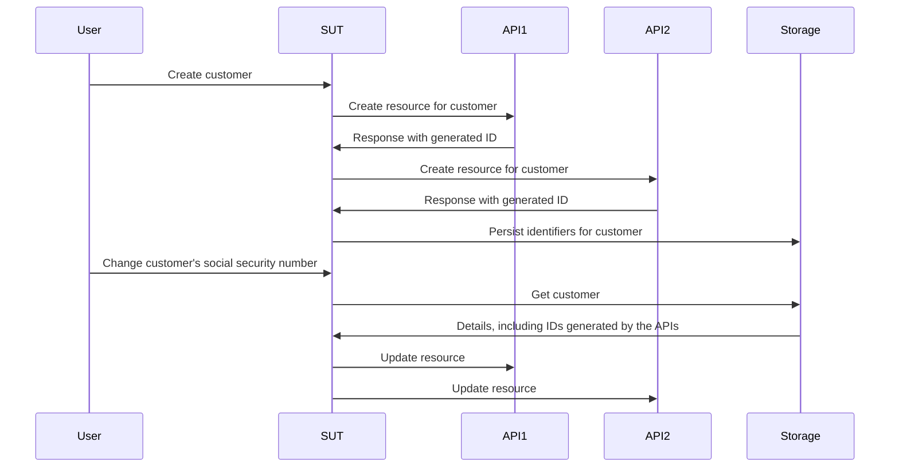

# Работа без моков, стабов и спаев

Эта глава погружает в мир тестовых дублёров и исследует, как они влияют на процесс тестирования и разработки. Мы раскроем ограничения традиционных моков, стабов и спаев и представим более эффективный и адаптивный подход с использованием фейков и контрактов.

## Вкратце

- Моки, спаи и стабы побуждают вас кодировать предположения о поведении ваших зависимостей в каждом тесте на месте.
- Эти предположения обычно не проверяются, кроме как вручную, поэтому они ставят под угрозу полезность вашего набора тестов.
- Фейки и контракты дают нам более устойчивый метод создания тестовых дублёров с проверенными предположениями и лучшей повторной используемостью по сравнению с альтернативами.

Это более длинная глава, чем обычно, поэтому для начала ознакомьтесь с [примером репозитория](https://github.com/quii/go-fakes-and-contracts). В частности, обратите внимание на [тест планировщика](https://github.com/quii/go-fakes-and-contracts/blob/main/domain/planner/planner_test.go).

---

В главе [Мокирование](https://quii.gitbook.io/learn-go-with-tests/go-fundamentals/mocking) мы узнали, как моки, стабы и спаи являются полезными инструментами для управления и проверки поведения единиц кода в сочетании с [внедрением зависимостей](https://quii.gitbook.io/learn-go-with-tests/go-fundamentals/dependency-injection).

Однако по мере роста проекта эти виды тестовых дублёров *могут* стать обузой для поддержки, и вместо этого нам следует обратиться к другим дизайнерским идеям, чтобы наша система оставалась легко осмысленной и тестируемой.

**Фейки** и **контракты** позволяют разработчикам тестировать свои системы в более реалистичных сценариях, улучшать локальный опыт разработки благодаря более быстрым и точным циклам обратной связи, а также управлять сложностью развивающихся зависимостей.

### Введение в тестовые дублёры

Легко закатить глаза, когда люди вроде меня придираются к номенклатуре тестовых дублёров, но различные виды тестовых дублёров помогают нам говорить об этой теме и компромиссах, на которые мы идём, с ясностью.

**Тестовые дублёры** — это собирательное название для различных способов конструирования зависимостей, которыми вы можете управлять для **тестируемого объекта (SUT)**, то есть того, что вы тестируете. Тестовые дублёры часто являются лучшей альтернативой использованию реальной зависимости, так как они могут избежать таких проблем, как:

- Необходимость подключения к интернету для использования API
- Избегание задержек и других проблем с производительностью
- Невозможность протестировать сценарии, не относящиеся к "счастливому пути"
- Отвязка вашей сборки от сборки другой команды.
  - Вы бы не хотели блокировать развёртывание, если инженер из другой команды случайно отправил ошибку

В Go вы обычно моделируете зависимость с помощью интерфейса, а затем реализуете свою версию для управления поведением в тесте. **Вот виды тестовых дублёров, рассмотренные в этом посте**.

Учитывая этот интерфейс гипотетического API рецептов:

```go
type RecipeBook interface {
	GetRecipes() ([]Recipe, error)
	AddRecipes(...Recipe) error
}
```

Мы можем конструировать тестовые дублёры различными способами, в зависимости от того, как мы пытаемся протестировать что-то, что использует `RecipeBook`.

**Стабы** возвращают одни и те же заранее определённые данные при каждом вызове.

```go
type StubRecipeStore struct {
	recipes []Recipe
	err     error
}

func (s *StubRecipeStore) GetRecipes() ([]Recipe, error) {
	return s.recipes, s.err
}

// AddRecipes omitted for brevity
```

```go
// in test, we can set up the stub to always return specific recipes, or an error
stubStore := &StubRecipeStore{
	recipes: someRecipes,
}
```

**Спаи** похожи на стабы, но также записывают, как они были вызваны, чтобы тест мог утверждать, что SUT вызывает зависимости определённым образом.

```go
type SpyRecipeStore struct {
	AddCalls [][]Recipe
	err      error
}

func (s *SpyRecipeStore) AddRecipes(r ...Recipe) error {
	s.AddCalls = append(s.AddCalls, r)
	return s.err
}

// GetRecipes omitted for brevity
```

```go
// in test
spyStore := &SpyRecipeStore{}
sut := NewThing(spyStore)
sut.DoStuff()

// now we can check the store had the right recipes added by inspectiong spyStore.AddCalls
```

**Моки** похожи на надмножество вышеперечисленного, но они отвечают только определёнными данными на определённые вызовы. Если SUT вызывает зависимости с неправильными аргументами, он обычно паникует.

```go
// set up the mock with expected calls
mockStore := &MockRecipeStore{}
mockStore.WhenCalledWith(someRecipes).Return(someError)

// when the sut uses the dependency, if it doesn't call it with someRecipes, usually mocks will panic
```

**Фейки** — это как настоящая версия зависимости, но реализованная таким образом, который больше подходит для быстро работающих, надёжных тестов и локальной разработки. Часто ваша система будет иметь некоторую абстракцию вокруг постоянного хранения данных, которая будет реализована с использованием базы данных, но в ваших тестах вы можете использовать вместо неё фейк, работающий в памяти.

```go
type FakeRecipeStore struct {
	recipes []Recipe
}

func (f *FakeRecipeStore) GetRecipes() ([]Recipe, error) {
	return f.recipes, nil
}

func (f *FakeRecipeStore) AddRecipes(r ...Recipe) error {
	f.recipes = append(f.recipes, r...)
	return nil
}
```

Фейки полезны, потому что:

- Их сохранение состояния полезно для тестов, включающих несколько объектов и вызовов, например, для интеграционного теста. Управление состоянием с другими видами тестовых дублёров обычно не рекомендуется.
- Если у них есть разумный API, они предлагают более естественный способ проверки состояния. Вместо того чтобы шпионить за конкретными вызовами к зависимости, вы можете запросить её конечное состояние, чтобы увидеть, произошёл ли желаемый эффект.
- Вы можете использовать их для запуска вашего приложения локально, не разворачивая и не завися от реальных зависимостей. Это обычно улучшает опыт разработчика (DX), потому что фейки будут быстрее и надёжнее своих реальных аналогов.

Спаи, моки и стабы обычно могут быть автоматически сгенерированы из интерфейса с помощью инструмента или с использованием рефлексии. Однако, поскольку фейки кодируют поведение зависимости, для которой вы пытаетесь создать дублёр, вам придётся написать большую часть реализации самостоятельно.

## Проблема со стабами и моками

В [Антипаттернах](https://quii.gitbook.io/learn-go-with-tests/meta/anti-patterns) подробно описано, как следует осторожно использовать тестовые дублёры. Создать беспорядочный набор тестов легко, если вы не используете их со вкусом. Однако по мере роста проекта могут возникнуть другие проблемы.

Когда вы кодируете поведение в тестовые дублёры, вы добавляете свои предположения о том, как работает реальная зависимость, в тест. Если между поведением дублёра и реальной зависимостью возникает расхождение, или если оно происходит со временем (например, реальная зависимость меняется, что *должно* ожидаться), **у вас могут быть проходящие тесты, но неработающее программное обеспечение**.

Стабы, спаи и моки, в частности, представляют другие проблемы, главным образом по мере роста проекта. Чтобы проиллюстрировать это, я опишу проект, над которым работал.

### Пример из практики

*Некоторые детали изменены по сравнению с тем, что произошло на самом деле, и значительно упрощены для краткости. **Любое сходство с реальными людьми, живыми или мёртвыми, является чисто случайным.***

Я работал над системой, которая должна была вызывать **шесть** различных API, написанных и поддерживаемых другими командами по всему миру. Они были _REST-подобными_, и задачей нашей системы было создавать и управлять ресурсами во всех из них. Когда мы правильно вызывали все API для каждой системы, происходила _магия_ (бизнес-ценность).

Наше приложение было структурировано по гексагональной архитектуре / архитектуре портов и адаптеров. Наш доменный код был отделён от внешнего мира, с которым нам приходилось иметь дело. Наши "адаптеры", по сути, были Go-клиентами, инкапсулирующими вызов различных API.


#### Проблемы

Естественно, мы применили подход, основанный на тестировании, к построению системы. Мы использовали стабы для симуляции ответов нижестоящих API и имели несколько приёмочных тестов, чтобы убедиться, что всё должно работать.

Однако API, которые нам приходилось вызывать, по большей части были:

- плохо документированы
- управлялись командами, у которых было много других конфликтующих приоритетов и давлений, поэтому было нелегко получить время для общения с ними
- часто не хватало тестового покрытия, поэтому они ломались забавными и неожиданными способами, регрессировали и т.д.
- всё ещё разрабатывались и эволюционировали

Это привело к **множеству нестабильных тестов** и множеству головных болей. _Значительное_ количество нашего времени тратилось на то, чтобы пинговать множество занятых людей в Slack, пытаясь получить ответы на вопросы:

- Почему API начал делать `x`?
- Почему API делает что-то другое, когда мы делаем `y`?

Разработка программного обеспечения редко бывает такой простой, как хотелось бы; это процесс обучения. Нам приходилось постоянно изучать, как работают внешние API. По мере обучения и адаптации мы должны были обновлять и дополнять наш набор тестов, в частности, **изменяя наши стабы, чтобы они соответствовали фактическому поведению API.**

Проблема в том, что это отнимало много нашего времени и приводило к большему количеству ошибок. Когда ваши знания о зависимости меняются, вы должны найти **правильный** тест для обновления, чтобы изменить поведение стаба, и существует реальный риск того, что вы забудете обновить его в других стабах, представляющих ту же зависимость.

#### Стратегия тестирования

Кроме того, по мере роста системы и изменения требований мы поняли, что наша стратегия тестирования непригодна. У нас было несколько приёмочных тестов, которые давали нам уверенность в работе системы в целом, а затем большое количество модульных тестов для различных пакетов, которые мы написали.

<u>Нам нужно было что-то среднее</u>; мы часто хотели изменить поведение различных частей системы вместе, **но не запускать *всю* систему для приёмочного теста**. Одни только модульные тесты не давали нам уверенности в том, что различные компоненты работают как единое целое; они не могли рассказать (и проверить) историю того, чего мы пытались достичь. **Мы хотели интеграционные тесты**.

#### Интеграционные тесты

Интеграционные тесты доказывают, что две или более "единицы" работают правильно при объединении (или интеграции!). Этими единицами может быть ваш код или ваш код, интегрированный с чужим кодом, например, с базой данных.

По мере роста проекта вы захотите писать больше интеграционных тестов, чтобы доказать, что большие части вашей системы "сочетаются" или интегрируются!

Возможно, вас будет соблазнять написание большего количества приёмочных тестов "чёрного ящика", но они быстро становятся затратными с точки зрения времени сборки и затрат на поддержку. Может быть слишком дорого запускать всю систему, когда вы хотите проверить только *подмножество* системы (но не только одну единицу), работает ли оно так, как должно. Написание дорогих тестов "чёрного ящика" для каждой части функциональности, которую вы выполняете, не является устойчивым для больших систем.

#### Встречайте: Фейки

Проблема заключалась в том, что наши модули тестировались с использованием стабов, которые по большей части *без сохранения состояния*. Мы хотели писать тесты, охватывающие несколько *сохраняющих состояние* вызовов API, где мы могли бы создать ресурс в начале, а затем отредактировать его позже.

Ниже приведена сокращённая версия теста, который мы хотим провести.

SUT — это "слой сервисов", обрабатывающий запросы "сценариев использования". Мы хотим доказать, что при создании клиента и изменении его данных мы успешно обновляем ресурсы, созданные нами в соответствующих API.

Вот требования, предоставленные команде в виде пользовательской истории.

> ***Дано*** пользователь зарегистрирован в API 1, 2 и 3
>
> ***Когда*** изменяется номер социального страхования клиента
>
> ***Тогда*** изменение распространяется на API 1, 2 и 3



Тесты, которые охватывают несколько модулей, обычно несовместимы со стабами, **потому что они не подходят для поддержания состояния**. Мы _могли бы_ написать приёмочный тест "чёрного ящика", но затраты на такие тесты быстро вышли бы из-под контроля.

Кроме того, сложно тестировать граничные случаи с помощью теста "чёрного ящика", потому что вы не можете контролировать зависимости. Например, мы хотели доказать, что механизм отката будет запущен, если один вызов API завершится неудачей.

Нам нужно было использовать **фейки**. Моделируя наши зависимости как сохраняющие состояние API с помощью фейков в памяти, мы смогли писать интеграционные тесты с гораздо более широким охватом, **чтобы позволить нам проверять работу реальных сценариев использования**, опять же *без* необходимости разворачивать всю систему, и вместо этого иметь почти ту же скорость, что и модульные тесты.


Используя фейки, **мы можем делать утверждения на основе конечных состояний соответствующих систем, а не полагаться на сложное шпионящее поведение**. Мы бы спрашивали у каждого фейка, какие записи о клиенте он хранит, и утверждали, что они были обновлены. Это кажется более естественным; если бы мы вручную проверяли нашу систему, мы бы запрашивали эти API для проверки их состояния, а не просматривали наши логи запросов, чтобы увидеть, отправили ли мы определённые JSON-запросы.

```go
// take our lego-bricks and assemble the system for the test
fakeAPI1 := fakes.NewAPI1()
fakeAPI2 := fakes.NewAPI2() // etc..
customerService := customer.NewService(fakeAPI1, fakeAPI2, etc...)

// create new customer
newCustomerRequest := NewCustomerReq{
	// ...
}
createdCustomer, err := customerService.New(newCustomerRequest)
assert.NoErr(t, err)

// we can verify all the details are as expected in the various fakes in a natural way, as if they're normal APIs
fakeAPI1Customer := fakeAPI1.Get(createdCustomer.FakeAPI1Details.ID)
assert.Equal(t, fakeAPI1Customer.SocialSecurityNumber, newCustomerRequest.SocialSecurityNumber)

// repeat for the other apis we care about

// update customer
updatedCustomerRequest := NewUpdateReq{SocialSecurityNumber: "123", InternalID: createdCustomer.InternalID}
assert.NoErr(t, customerService.Update(updatedCustomerRequest))

// again we can check the various fakes to see if the state ends up how we want it
updatedFakeAPICustomer := fakeAPI1.Get(createdCustomer.FakeAPI1Details.ID)
assert.Equal(t, updatedFakeAPICustomer.SocialSecurityNumber, updatedCustomerRequest.SocialSecurityNumber)
```

Это проще писать и легче читать, чем проверять различные аргументы вызовов функций, сделанные через спаи.

Этот подход позволяет нам иметь тесты, охватывающие обширные части нашей системы, позволяя писать более **осмысленные** тесты о сценариях использования, которые мы обсуждали бы на стендапе, при этом выполняясь исключительно быстро.

#### Фейки приносят больше преимуществ инкапсуляции

В приведённом выше примере тесты не заботились о том, как вели себя зависимости, помимо проверки их конечного состояния. Мы создали фейковые версии зависимостей и внедрили их в ту часть системы, которую тестируем.

С моками/стабами нам пришлось бы настраивать каждую зависимость для обработки определённых сценариев, возвращения определённых данных и т.д. Это привносит поведение и детали реализации в ваши тесты, ослабляя преимущества инкапсуляции.

Мы моделируем зависимости за интерфейсами так, чтобы как клиенты, _мы не должны были заботиться о том, как это работает_, но с "мок-ориентированным" подходом, _мы **должны** заботиться об этом **в каждом тесте**_.

#### Затраты на поддержку фейков

Фейки дороже других тестовых дублёров, по крайней мере, с точки зрения написанного кода; они должны сохранять состояние и имитировать поведение того, что они подделывают. Любые расхождения в поведении между вашим фейком и реальной вещью **несут риск** того, что ваши тесты не соответствуют реальности. Это приводит к сценарию, когда у вас есть проходящие тесты, но сломанное программное обеспечение.

Всякий раз, когда вы интегрируетесь с другой системой, будь то API другой команды или база данных, вы будете делать предположения, основанные на её поведении. Они могут быть получены из документации API, личных бесед, электронных писем, переписок в Slack и т.д.

Разве не было бы полезно, если бы мы могли **кодифицировать наши предположения**, чтобы проверять их как на нашем фейке, *так и* на реальной системе, чтобы увидеть, верны ли наши знания, повторяемым и задокументированным способом?

**Контракты** — это средство для достижения этой цели. Они помогли нам управлять предположениями, которые мы делали относительно систем других команд, и делать их явными. Гораздо более явными и полезными, чем переписка по электронной почте или бесконечные ветки в Slack!


Имея контракт, мы можем предположить, что можем использовать фейк и фактическую зависимость взаимозаменяемо. Это полезно не только для построения тестов, но и для локальной разработки.

Вот пример контракта для одного из API, от которого зависит система:

```go
type API1Customer struct {
	Name string
	ID   string
}

type API1 interface {
	CreateCustomer(ctx context.Context, name string) (API1Customer, error)
	GetCustomer(ctx context.Context, id string) (API1Customer, error)
	UpdateCustomer(ctx context.Context, id string, name string) error
}

type API1Contract struct {
	NewAPI1 func() API1
}

func (c API1Contract) Test(t *testing.T) {
	t.Run("can create, get and update a customer", func(t *testing.T) {
		var (
			ctx  = context.Background()
			sut  = c.NewAPI1()
			name = "Bob"
		)

		customer, err := sut.CreateCustomer(ctx, name)
		expect.NoErr(t, err)

		got, err := sut.GetCustomer(ctx, customer.ID)
		expect.NoErr(t, err)
		expect.Equal(t, customer, got)

		newName := "Robert"
		expect.NoErr(t, sut.UpdateCustomer(ctx, customer.ID, newName))

		got, err = sut.GetCustomer(ctx, customer.ID)
		expect.NoErr(t, err)
		expect.Equal(t, newName, got.Name)
	})

	// example of strange behaviours we didn't expect
	t.Run("the system will not allow you to add 'Dave' as a customer", func(t *testing.T) {
		var (
			ctx  = context.Background()
			sut  = c.NewAPI1()
			name = "Dave"
		)

		_, err := sut.CreateCustomer(ctx, name)
		expect.Err(t, ErrDaveIsForbidden)
	})
}
```

Как обсуждалось в [Масштабировании приёмочных тестов](https://quii.gitbook.io/learn-go-with-tests/testing-fundamentals/scaling-acceptance-tests), при тестировании на основе интерфейса, а не конкретного типа, тест становится:

- Отделённым от деталей реализации
- Может быть повторно использован в различных контекстах.

Что является требованиями к контракту. Это позволяет нам проверять и разрабатывать наш фейк _и_ тестировать его на реальной реализации.

Для создания нашего фейка в памяти мы можем использовать контракт в тесте.

```go
func TestInMemoryAPI1(t *testing.T) {
	API1Contract{NewAPI1: func() API1 {
		return inmemory.NewAPI1()
	}}.Test(t)
}
```

А вот код фейка:

```go
func NewAPI1() *API1 {
	return &API1{customers: make(map[string]planner.API1Customer)}
}

type API1 struct {
	i         int
	customers map[string]planner.API1Customer
}

func (a *API1) CreateCustomer(ctx context.Context, name string) (planner.API1Customer, error) {
	if name == "Dave" {
		return planner.API1Customer{}, ErrDaveIsForbidden
	}

	newCustomer := planner.API1Customer{
		Name: name,
		ID:   strconv.Itoa(a.i),
	}
	a.customers[newCustomer.ID] = newCustomer
	a.i++
	return newCustomer, nil
}

func (a *API1) GetCustomer(ctx context.Context, id string) (planner.API1Customer, error) {
	return a.customers[id], nil
}

func (a *API1) UpdateCustomer(ctx context.Context, id string, name string) error {
	customer := a.customers[id]
	customer.Name = name
	a.customers[id] = customer
	return nil
}
```

### Развитие программного обеспечения

Большинство программного обеспечения не создаётся и не "завершается" навсегда за один выпуск.

Это постепенный процесс обучения, адаптации к требованиям клиентов и другим внешним изменениям. В примере API, которые мы вызывали, также развивались и менялись; кроме того, по мере разработки _нашего_ программного обеспечения мы узнавали больше о том, какую систему нам _действительно_ нужно было создать. Предположения, сделанные нами в наших контрактах, оказались неверными или _стали_ неверными.

К счастью, после настройки контрактов у нас появился простой способ справляться с изменениями. Как только мы узнавали что-то новое, будь то исправление ошибки или сообщение коллеги об изменении API, мы делали следующее:

1. Написать тест для проверки нового сценария. Часть этого будет включать изменение контракта, чтобы **направить** вас на симуляцию поведения в фейке.
2. Выполнение теста должно завершиться неудачей, но прежде чем что-либо ещё, запустите контракт против реальной зависимости, чтобы убедиться, что изменение контракта является действительным.
3. Обновите фейк так, чтобы он соответствовал контракту.
4. Добиться прохождения теста.
5. Рефакторинг.
6. Запустить все тесты и выпустить.

Запуск _полного_ набора тестов перед проверкой _может_ привести к сбою других тестов из-за того, что фейк ведёт себя иначе. Это **хорошо**! Теперь вы можете исправить все другие области системы, зависящие от изменённой системы; будучи уверенными, что они также обработают этот сценарий в продакшене. Без этого подхода вам пришлось бы *помнить* о поиске всех соответствующих тестов и обновлении стабов. Это подвержено ошибкам, трудоёмко и скучно.

### Превосходный опыт разработчика

Наличие набора фейков с соответствующими контрактами ощущалось как суперсила. Мы наконец-то смогли укротить сложность API, с которыми нам приходилось иметь дело.

Написание тестов для различных сценариев стало намного проще. Нам больше не нужно было собирать серию стабов и спаев для каждого теста; мы могли взять наш набор модулей (фейки, наши собственные "сервисы") и очень легко собирать их для отработки различных странных и замечательных сценариев, которые нам требовались.

Каждый тест со стабом, спаем или моком должен _заботиться_ о том, как ведёт себя внешняя система, из-за одноразовой настройки. С другой стороны, фейки можно рассматривать как любую другую хорошо инкапсулированную единицу кода, где детали скрыты от вас, и вы можете просто их использовать.

Мы могли запускать очень реалистичную версию системы локально, и поскольку она вся находилась в памяти, она запускалась и работала чрезвычайно быстро. Это означало, что время наших тестов было чрезвычайно быстрым, что ощущалось очень впечатляюще, учитывая, насколько исчерпывающим был набор тестов.

Если наши приёмочные тесты падали в тестовой среде, первым шагом было запустить наши контракты против API, от которых мы зависели. Мы часто выявляли проблемы **раньше, чем разработчики других систем**.

### Сход с "счастливого пути" с помощью декораторов

Для сценариев с ошибками стабы более удобны, потому что у вас есть прямой доступ к тому, *как* они ведут себя в тесте, тогда как фейки, как правило, являются довольно "чёрными ящиками". Это преднамеренный выбор дизайна, поскольку мы хотим, чтобы пользователи (например, тесты) не беспокоились о том, как они работают; они должны доверять, что они делают правильные вещи благодаря поддержке контракта.

Как заставить фейки работать с ошибками, чтобы проверить сценарии, не относящиеся к "счастливому пути"?

Существует множество сценариев, когда как разработчику вам необходимо изменить поведение некоторого кода, не меняя его исходный код. **Паттерн "декоратор"** часто является способом взять единицу кода и добавить такие вещи, как логирование, телеметрию, повторные попытки и многое другое. Мы можем использовать его для обёртывания наших фейков, чтобы переопределить поведение при необходимости.

Возвращаясь к примеру `API1`, мы можем создать тип, который реализует необходимый интерфейс и оборачивает фейк.

```go
type API1Decorator struct {
	delegate           API1
	CreateCustomerFunc func(ctx context.Context, name string) (API1Customer, error)
	GetCustomerFunc    func(ctx context.Context, id string) (API1Customer, error)
	UpdateCustomerFunc func(ctx context.Context, id string, name string) error
}

// assert API1Decorator implements API1
var _ API1 = &API1Decorator{}

func NewAPI1Decorator(delegate API1) *API1Decorator {
	return &API1Decorator{delegate: delegate}
}

func (a *API1Decorator) CreateCustomer(ctx context.Context, name string) (API1Customer, error) {
	if a.CreateCustomerFunc != nil {
		return a.CreateCustomerFunc(ctx, name)
	}
	return a.delegate.CreateCustomer(ctx, name)
}

func (a *API1Decorator) GetCustomer(ctx context.Context, id string) (API1Customer, error) {
	if a.GetCustomerFunc != nil {
		return a.GetCustomerFunc(ctx, id)
	}
	return a.delegate.GetCustomer(ctx, id)
}

func (a *API1Decorator) UpdateCustomer(ctx context.Context, id string, name string) error {
	if a.UpdateCustomerFunc != nil {
		return a.UpdateCustomerFunc(ctx, id, name)
	}
	return a.delegate.UpdateCustomer(ctx, id, name)
}
```

В наших тестах мы можем затем использовать поле `XXXFunc` для изменения поведения тестового дублёра, точно так же, как вы делали бы со стабами, спаями или моками.

```go
failingAPI1 = NewAPI1Decorator(inmemory.NewAPI1())
failingAPI1.UpdateCustomerFunc = func(ctx context.Context, id string, name string) error {
	return errors.New("failed to update customer")
}
```

Однако это _неудобно_ и требует от вас определённого суждения. При таком подходе вы теряете гарантии, предоставляемые вашим контрактом, поскольку вы вводите одноразовое поведение в ваш фейк в тестах.

Было бы лучше изучить ваш контекст, возможно, вы придёте к выводу, что проще тестировать конкретные "несчастливые пути" на уровне модульных тестов с использованием стаба.

### Разве это не лишняя трата кода?

Это принятие желаемого за действительное — полагать, что мы всегда должны писать только тот код, который служит клиентам, и ожидать систему, на которой мы можем эффективно строить. У людей очень искажённое представление о том, что такое отходы (см. мой пост: [Призрак Генри Форда губит вашу команду разработки](https://quii.dev/The_ghost_of_Henry_Ford_is_ruining_your_development_team)).

Автоматизированные тесты не приносят прямой пользы клиентам, но мы пишем их, чтобы сделать свою работу более эффективной (вы ведь не пишете тесты ради показателей покрытия, верно?).

Инженеры должны легко имитировать сценарии (повторяемым образом, а не на месте) для отладки, тестирования и исправления проблем. **Фейки в памяти и хороший модульный дизайн позволяют нам изолировать соответствующие акторы для сценария, чтобы писать быстрые, подходящие тесты чрезвычайно дёшево**. Эта гибкость позволяет разработчикам итерировать систему гораздо более управляемым способом, чем запутанный беспорядок, тестируемый с помощью дорогостоящих в написании и запуске тестов "чёрного ящика" или, что ещё хуже, ручного тестирования в общей среде.

Это пример [простого против лёгкого](https://www.youtube.com/watch?v=SxdOUGdseq4). Конечно, фейки и контракты приведут к написанию большего количества кода, чем стабы и спаи, в краткосрочной перспективе, но в долгосрочной перспективе результатом будет более простая и дешёвая в поддержке система. Обновление спаев, стабов и моков по частям является трудоёмким и подверженным ошибкам, так как у вас не будет соответствующих контрактов для проверки правильности поведения ваших тестовых дублёров.

Этот подход представляет собой _незначительно_ увеличенные первоначальные затраты, но с гораздо более низкими затратами после того, как контракты и фейки настроены. Фейки более многоразовые и надёжные, чем временные тестовые дублёры, такие как стабы.

Использование существующего, проверенного в бою фейка вместо настройки стаба при написании нового теста ощущается *очень* раскрепощающим и даёт вам **уверенность**.

### Как это вписывается в TDD?

Я бы не рекомендовал _начинать_ с контракта; это нисходящее проектирование, для которого, как я обычно считаю, мне нужно быть более изобретательным, и есть опасность, что я переосмыслю гипотетические требования.

Эта техника совместима с "подходом, управляемым приёмочными тестами", как обсуждалось в предыдущих главах, [The Why of TDD](https://quii.dev/The_Why_of_TDD) и в [GOOS](http://www.growing-object-oriented-software.com).

- Напишите не проходящий [приёмочный тест](https://quii.gitbook.io/learn-go-with-tests/testing-fundamentals/scaling-acceptance-tests).
- Создайте достаточно кода, чтобы он прошёл, что обычно приведёт к созданию "слоя сервисов", который будет зависеть от API, базы данных или чего-то ещё. Обычно код бизнес-логики отделяется от внешних concerns (таких как постоянное хранение данных, вызов базы данных и т.д.) через интерфейс.
- Сначала реализуйте интерфейс с помощью фейка в памяти, чтобы все тесты проходили локально и подтверждали первоначальный дизайн.
- Чтобы отправить в продакшен, вы не можете использовать фейк в памяти! Закодируйте предположения, сделанные вами относительно фейка, в контракт.
- Используйте контракт для создания реальной зависимости, такой как версия хранилища для MySQL.
- Выпускайте.

## Где глава о тестировании баз данных?

Это был частый запрос, который я откладывал более пяти лет. Причина в том, что эта глава всегда будет моим ответом.

<u>Не мокируйте драйвер базы данных и не шпионьте за вызовами</u>. Эти тесты сложно писать, и они потенциально приносят очень мало пользы. Вы не должны утверждать, был ли отправлен в базу данных определённый `SQL` оператор — это деталь реализации; **ваши тесты должны заботиться только о поведении**. Доказательство того, что конкретный SQL-оператор был скомпилирован, _не_ доказывает, что ваш код _ведёт себя_ так, как вам нужно.

**Контракты** заставляют вас отделить ваши тесты от деталей реализации и сосредоточиться на поведении.

Следуйте описанному выше подходу TDD, чтобы определить ваши потребности в постоянном хранении данных.

[Пример репозитория](https://github.com/quii/go-fakes-and-contracts) содержит несколько примеров контрактов и того, как они используются для тестирования реализаций в памяти и SQLite некоторых потребностей в постоянном хранении данных.

```go
package inmemory_test

import (
	"github.com/quii/go-fakes-and-contracts/adapters/driven/persistence/inmemory"
	"github.com/quii/go-fakes-and-contracts/domain/planner"
	"testing"
)

func TestInMemoryPantry(t *testing.T) {
	planner.PantryContract{
		NewPantry: func() planner.Pantry {
			return inmemory.NewPantry()
		},
	}.Test(t)
}
```

```go
package sqlite_test

import (
	"github.com/quii/go-fakes-and-contracts/adapters/driven/persistence/sqlite"
	"github.com/quii/go-fakes-and-contracts/domain/planner"
	"testing"
)

func TestSQLitePantry(t *testing.T) {
	client := sqlite.NewSQLiteClient()
	t.Cleanup(func() {
		if err := client.Close(); err != nil {
			t.Error(err)
		}
	})

	planner.PantryContract{
		NewPantry: func() planner.Pantry {
			return sqlite.NewPantry(client)
		},
	}.Test(t)
}
```

Хотя Docker и т.д. _действительно_ упрощают локальный запуск баз данных, они всё ещё могут нести значительные накладные расходы на производительность. Фейки с контрактами позволяют ограничить необходимость использования "более тяжёлой" зависимости только для проверки контракта, и они не требуются для других видов тестов.

Использование фейков в памяти для приёмочных и интеграционных тестов для *остальной* части системы обеспечивает гораздо более быстрый и простой опыт разработчика.

## Подведём итоги

Обычная практика для программных проектов — организация работы с несколькими командами, которые одновременно создают системы, пытаясь достичь общей цели.

Этот метод работы требует высокой степени сотрудничества и коммуникации. Многие считают, что при подходе "сначала API" мы можем определить некоторые контракты API (часто на вики-странице!) и затем работать независимо в течение шести месяцев, а затем всё это собрать воедино. На практике это редко работает хорошо, потому что, когда мы начинаем писать код, мы лучше понимаем предметную область и проблему, что оспаривает наши предположения. Мы должны реагировать на эти изменения в знаниях, что часто требует межкомандных изменений.

Поэтому, если вы находитесь в такой ситуации, вам необходимо оптимально структурировать и тестировать вашу систему, чтобы справляться с непредсказуемыми изменениями как внутри, так и вне системы, над которой вы работаете.

> «Одна из определяющих характеристик высокопроизводительных команд в разработке программного обеспечения — это их способность продвигаться вперёд и менять свои решения, не спрашивая разрешения ни у кого извне своей небольшой команды».
>
> Modern Software Engineering
> Дэвид Фарли

Не полагайтесь на еженедельные встречи или ветки в Slack для проработки изменений. **Кодифицируйте свои предположения в контрактах**. Запускайте эти контракты против систем в ваших сборочных конвейерах, чтобы получать быструю обратную связь, если появляется новая информация. Эти контракты, в сочетании с **фейками**, означают, что вы можете работать независимо и устойчиво управлять внешними изменениями.

### Ваша система как набор модулей

Возвращаясь к книге Фарли, я описываю идею **инкрементализма**. Создание программного обеспечения — это *постоянный процесс обучения*. Понимание требований, которые мы должны решить для данной системы, чтобы обеспечить ценность заранее, нереалистично. Поэтому мы должны оптимизировать наши системы и методы работы для **быстрого сбора обратной связи и экспериментов**.

Вам нужна **модульная система**, чтобы воспользоваться идеями, обсуждаемыми в этой главе. Если у вас есть модульный код с надёжными фейками, это позволяет вам дёшево экспериментировать с вашей системой с помощью автоматизированных тестов.

Нам было чрезвычайно легко переводить странные, гипотетические (но возможные) сценарии в самодостаточные тесты, чтобы помочь нам понять проблему и разработать более надёжное программное обеспечение, компонуя наши модули вместе и пробуя различные данные в разном порядке, с некоторыми неработающими API и т. д.

Хорошо определённые, хорошо протестированные модули позволяют вам развивать вашу систему, не меняя и не понимая _всё_ сразу.

### Но я работаю над чем-то небольшим со стабильными API

Даже со стабильными API вы не хотите, чтобы ваш опыт разработчика, сборки и так далее были тесно связаны с чужим кодом. Когда вы правильно используете этот подход, вы получаете компонуемый набор модулей для сборки вашей системы для продакшена, локального запуска и написания различных видов тестов с дублёрами, которым вы доверяете.

Это позволяет вам изолировать части вашей системы, которые вас беспокоят, и писать осмысленные тесты о реальной проблеме, которую вы пытаетесь решить.

### Сделайте ваши зависимости первоклассными сущностями.

Конечно, стабы и спаи имеют своё место. Симуляция различного поведения ваших зависимостей на лету в тестах всегда будет иметь применение, но будьте осторожны, чтобы затраты не вышли из-под контроля.

Столько раз в своей карьере я видел, как тщательно написанное программное обеспечение талантливыми разработчиками разваливалось из-за проблем с интеграцией. Интеграция сложна для инженеров _потому что_ трудно воспроизвести точное поведение системы, написанной другими инженерами, которые также меняют её одновременно.

Некоторые команды полагаются на то, что все развёртывают свои изменения в общей среде и тестируют там. Проблема в том, что это не даёт вам **изолированной** обратной связи, а **обратная связь медленная**. Вы всё равно не сможете эффективно строить различные эксперименты с тем, как ваша система работает с другими зависимостями.

**Мы должны укротить эту сложность, применяя более сложные способы моделирования наших зависимостей**, чтобы быстро тестировать/экспериментировать на наших машинах разработки, прежде чем это попадёт в продакшн. Создавайте реалистичные и управляемые фейки ваших зависимостей, проверенные контрактами. Тогда вы сможете начать писать более осмысленные тесты и экспериментировать с вашей системой, что повысит ваши шансы на успех.